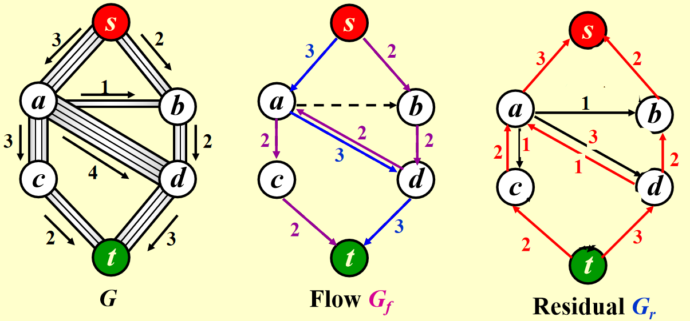

# 1  Basis

## Time complexity  &  Space complexity

> When analyzing the time complexity, generally $T_{avg}(N)$ and $T_{worst}(N)$​ are analyzed. 

1. $T(N)=O(f(N))$ if there are positive constants $c$ and $n_0$ such that $T(N)\leq c\times f(N)$ for all $N\geq n_0$ .

2. $T(N)=\Omega (g(N))$ if there are positive constants $c$ and $n_0$ such that $T(N)\geq c\times g(N)$ for all $N\geq n_0$ .

3. $T(N)=\Theta (h(N))$ if and only if $T(N)=O(h(N))$ and $T(N)=\Omega(h(N))$.

4. $T(N)=o(h(N))$ if $T(N)=O(p(N))$ and $T(N)\neq \Theta (p(N))$​.

> Always pick the smallest upper bound and the largest lower bound.


- If $T_1(N)=O(f(N))$ and $T_2(N)=O(g(N))$, then:

  $T_1(N)+T_2(N)=\max(O(f(N)),O(g(N)))$

  $T_1(N)\times T_2(N)=O(f(N)\times g(N))$

- $\log^k N=O(N)$ for all constant $k$​ (Logarithms grow very slowly)


> Example: Fibonacci number

```c
int Fib(int N){
	if(N<=1){
		return 1;
	}else{
		return Fib(N-1)+Fib(N-2);
	}
}
```

$T(N)=T(N-1)+T(N-2)+2$

$(\frac{3}{2})^N \leq Fib(N) \leq (\frac{5}{3})^N$​


> When $T(N)=O(f(N))$, it is guaranteed that $\lim\limits_{N\to\infty} \frac{f(N)}{T(N)} = constant$ or $\lim\limits_{N\to\infty}\frac{f(N)}{T(N)}=+\infty$​


# 2 Examples

## Max Subsequence Sum

- **Problem Description**: Given (possibly negative) integers $A_1, A_2, \cdots, A_N$, find the maximum value of $\sum\limits_{k=i}^{j} A_k $.

- **Algorithm 1**

  ```c
  int MaxSubsequenceSum(int A[],int N){
  	int ThisSum,MaxSum,i,j,k;
      MaxSum=0;
      for(i=0;i<N;i++){
          for(j=i;j<N;j++){
              ThisSum=0;
              for(k=i;k<=j;k++){
                  ThisSum+=A[k];
              }
              if(ThisSum>MaxSum){
                  MaxSum=ThisSum;
              }
          }
      }
      return MaxSum;
  }
  ```

  This algorithm is simple and easy to understand: Find all the possible subsequences and compare them to find the maximum value.

  Nevertheless, it is a typically bad algorithm with $T(N)=O(N^3)$​​.

- **Algorithm 2**

  ```c
  int MaxSubsequenceSum(int A[],int N){
      int ThisSum,MaxSum,i,j;
      MaxSum=0;
      for(i=0;i<N;i++){
          ThisSum=0;
          for(j=i;j<N;j++){
              ThisSum+=A[j];
              if(ThisSum>MaxSum){
                  MaxSum=ThisSum;
              }
          }
      }
      return MaxSum;
  }
  ```

  The idea of this algorithm is basically simple to the previous one. However, is does an improvement because it scans through all the subsequences in a smarter way and reduce time complexity to $O(N^2)$.

- **Algorithm 3  Divide and Conquer**

  ```c
  int MaxSubSum(int A[],int left,int right){
      int MaxLeftSum,MaxRightSum;
      int MaxLeftBorderSum,MaxRightBorderSum;
      int LeftBorderSum,RightBorderSum;
      int center,i;
      
      if(left==right){
          if(A[left]>0){
              return A[left];
          }else{
              return 0;
          }
      }
      
      center=(left+right)/2;
      MaxLeftSum=MaxSubSum(A,left,center);
      MaxRightSum=MaxSubSum(A,center+1,right);
      
      MaxLeftBorderSum=0;
      LeftBorderSum=0;
      for(i=center;i>=left;i--){
          LeftBorderSum+=A[i];
          if(LeftBorderSum>MaxLeftBorderSum){
              MaxLeftBorderSum=LeftBorderSum;
          }
      }
      
      MaxRightBorderSum=0;
      RightBorderSum=0;
      for(i=center+1;i<=right;i++){
          RightBorderSum+=A[i];
          if(RightBorderSum>MaxRightBorderSum){
              MaxRightBorderSum=RightBorderSum;
          }
      }
      
      return MaxThree(MaxLeftSum,MaxRightSum,MaxLeftBorderSum+MaxRightBorderSum);
  }
  
  int MaxSubsequenceSum(int A[],int N){
      return MaxSubSum(A,0,N-1);
  }
  ```

  A complicated algorithm which involves recursions. The idea of the algorithm is to divide the whole set into two equal parts, calculate the max length of left part and right part, calculate the max length of subsequence which begins from center and extend leftward and rightward and return the maximum value of the three as the result.

  Time complexity analysis:

  $T(N)=2T(\frac{N}{2})+N$

  $T(N)=O(N\log N)$

  which is much better than $O(N^3)$ and $O(N^2)$.

- **Algorithm 4  Online Algorithm**

  ```c
  int MaxSubSequenceSum(int A[],int N){
      int ThisSum,MaxSum,j;
      ThisSum=0;
      MaxSum=0;
      for(j=0;j<N;j++){
          ThisSum+=A[j];
          if(ThisSum>MaxSum){
              MaxSum=ThisSum;
          }
          if(ThisSum<0){
              ThisSum=0;
          }
      }
      return MaxSum;
  }
  ```

  As is shown above, the algorithm is an online algorithm, which means that it can always return the correct result currently whenever it stops. 

  The idea of the algorithm is easy to understand. It simply scans through the whole array, add each value to $ThisSum$ and update it if necessary. If $ThisSum<0$​, it is set 0 because we can exclude the negative part in the max subsequence.

  The time complexity of this algorithm is $O(N)$​​, the best algorithm of all.

  

## Binary Search

- **Problem Description**: Given a sorted array $A$ and its size $N$, we need to find a particular element $X$. If found, return the index, otherwise return $-1$.

- **Algorithm**

  ```c
  int BinarySearch(int A[],int N,int X){
      int Low,Mid,High;
      Low=0;
      High=N-1;
      while(Low<=High){
          Mid=(Low+High)/2;
          if(A[Mid]==X){
              return Mid;
          }else if(A[Mid]<X){
              Low=Mid+1;
          }else{
              High=Mid-1;
          }
      }
      return -1;
  }
  ```

  Time complexity analysis:

  $T(N)=T(\frac{N}{2})+C$

  $T(N)=O(\log N)$


# 3 List

- Key Operations:
  1. Finding the $k$-th item in the list, $0\leq k< N$
  2. Inserting a new item after the $k$-th item of the list, $0\leq k<N$
  3. Deleting an item from the list

>List ADT can be implemented with array and linked list.

- Array Implementation:

  1. Finding operation is quick and simple.
  2. Does not involve pointers and the allocation of memory.
  3. Maxsize has to be estimated in advance.
  4. Insertion and Deletion take $O(N)$ time and involves numerous movements of data.

- Linked List Implementation:

  - Initialization:

    Singly Linked List:

    ```c
    typedef struct node* List;
    struct node{
        ElementType Data;
        List Next;
    };
    ```

    Doubly Linked Circular List:

    ```c
    typedef struct node* List;
    struct node{
        List Leftptr;
        ElementType Data;
        List Rightptr;
    }
    ```

  - Insertion:

    ```c
    List temp=(List)malloc(sizeof(struct node));
    temp->Data=1;
    temp->Next=Current->Next;
    Current->Next=temp;
    ```

    >Always connect temp to the next node first.

    Time complexity: $O(1)$

  - Deletion:

    ```c
    temp=Pre->Next;
    Pre->Next=temp->Next;
    free(temp);
    ```

    > Always connect the previous node to next node first.

    Time complexity: $O(1)$

- Application: Polynomial ADT

  Objects:  $P(x)=a_1x^{e_1}+a_2x^{e_2}+\cdots+a_nx^{e_n}$

  Implementation: Linked List

  ```c
  typedef struct node* Polynomial;
  struct node{
      int Coefficient;
      int Exponent;
      Polynomial Next;
  }
  ```

> Other ADT: Multilist and Cursor Implementation of Linked List.


# 4 Stack

> A stack is a Last-In-First-Out (LIFO) list, namely, an ordered list in which insertions and deletions are made at the top only.

- Key Operations:

  ```c
  Push(ElementType X,Stack S);
  Pop(Stack S);
  ElementType Top(Stack S);
  ```

  > A pop on an empty stack results in ADT error, a push on a full stack results in implementation error.

- Linked List Implementation:

  >A header node is used (dummy header) .

  - Push: 

    ```c
    TmpCell->Next=S->Next;
    S->Next=TmpCell;
    ```

  - Top:

    ```c
    return S->Next->Element;
    ```

  - Pop:

    ```c
    Temp=S->Next;
    S->Next=S->Next->Next;
    free(Temp);
    ```

- Array Implementation:

  > The stack model is supposed to be well encapsulated.

  ```c
  struct Stack{
  	int Size;
      int Pointer;
      ElementType* Array;
  };
  ```

## Applications

### Balancing Symbols

- **Problem Description:**  Check if Parenthesis $()$, Brackets $[]$ and Braces $\{\}$ are balanced.

- **Algorithm**

  ```c
  bool BalancingSymbols(char Expression[],int N){
      char Stack[MAXN];
      int i,temp;
      for(i=0;i<N;i++){
          temp=Expression[i];
          if(temp=='('||'['||'{'){
              Push(temp,Stack);
          }else{
              if(Stack is Empty){
                  return false;
              }else if(Top(Stack)!=Corresponding Symbol){
                  return false;
              }else{
                  Pop(Stack);
              }
          }
      }
      if(Stack is Empty){
          return true;
      }else{
          return false;
      }
  }
  ```

  $T(N)=O(N)$, an online algorithm.


### Calculating Postfix Expression

> While a computer is calculating an expression, it firstly transform infix expression to postfix. Postfix expressions have advantages, like no parenthesis is needed.

- **Problem Description:** Given a postfix expression (Reverse Polish Notation) , calculate its value.

- **Example**: $6\ 2\ /\ 3\ -\ 4\ 2\ *\ +\ =8$

- **Algorithm**

  ```c
  int PostfixCalculation(char Expression[],int N){
      char Stack[MAXN];
      int i;
      char temp,temp1,temp2;
      for(i=0;i<N;i++){
          temp=Expression[i];
          if(temp>='0'&&temp<='9'){
              Push(temp,Stack);
          }else{
              temp1=Top(Stack);
              Pop(S);
              temp2=Top(Stack);
              Pop(S);
              Push(Calculate(temp1,temp2,temp),Stack);/*Details Omitted*/
          }
      }
      return Stack[0];
  }
  ```

  $T(N)=O(N)$


### Infix to Postfix Conversion

- **Problem Description:** Transform an infix expression to postfix expression.

- **Example:** $a\ +\ b\ *\ c\ -\ d\ =\ a\ b\ c\ *\ +\ d\ -$

- **Algorithm**

  ```c
  char* InfixtoPostfix(char Infix[],int N){
      Stack S;
      char* Result;
      for(i=0;i<N;i++){
          temp=Infix[i];
          if(temp is an Operand){
              Append temp to Result;
          }else{
              if(temp==')'){
                  Pop and append until '(';
              }
              while(Priority(Top(S))>=Priority(temp)){
                  Append Top(S) to Result;
                  Pop(S);
              }
              Push(temp,S);
          }
      }
      Pop and append until S is empty;
      return Result;
  }
  ```

  >Priority:
  >
  >'('  (Before Push)  >  '*'  '/'  >  '+'  '-'  >  '('  (After Push)

  $T(N)=O(N)$


### System Stack

>While running recursive programs, Return Address, Stack Frame, Local Variables are all pushed into the stack. If too many recursions are called, the system stack will be overflowed and the system will crash.

>Tail recursions can always be removed. Non-recursive programs are generally faster than equivalent recursive programs.

>When you write a recursive program, the compiler will automatically transformed the recursive program to non-recursive program. (Goto top may be used)

Example:

```c
void PrintList(List L){
    if(L!=NULL){
        printf("%d",L->Element);
        PrintList(L->Next);
    }
}
```

Will be transformed to:

```c
void PrintList(List L){
top:if(L!=NULL){
        printf("%d",L->Element);
        L=L->Next;
        goto top;
    }
}
```


# 5 Queue

> A queue is a First-In-First-Out (FIFO) list, namely, an ordered list in which insertions take place at one end and deletions take place at the opposite end.

- Key Operations:

  ```c
  Enqueue(ElementType X,Queue Q);
  ElementType Front(Queue Q);
  Dequeue(Queue Q);
  ```

> Generally queue ADT is implemented by arrays, because linked list implementation is way too trivial. For arrays, there are 2 categories: simple array and circular queue.

```c
struct Queue{
    int Front;
    int Rear;
    int Size;
    int Capacity;
    ElementType* Array;
};
```

- Circular Queue:
  - Initially Front = Rear+1.
  - If there is only 1 element, Front = Rear
  - There is bound to be 1 place that is empty. If all spaces are filled with elements, we cannot distinguish empty and full. (If a circular queue is full, Front = Rear+2.)
  - Arithmetic like $mod$​ will be included to implement the function of "Circular". (Like (Rear++)%Size)


# 6 Tree

> Terminologies:
>
> |       Root        |              Subtree               |             Edge             |          Node          |
> | :---------------: | :--------------------------------: | :--------------------------: | :--------------------: |
> | Degree of a Node  | Degree of a Tree (Max Node Degree) |            Parent            | Children (Left, Right) |
> |     Siblings      |             Leaf Node              |   Path (Sequence of Nodes)   |     Length of Path     |
> | Depth (D(root)=0) |         Height (H(Leaf)=0)         | Height (Depth) of Tree (Max) |  Ancestor&Descendant   |

- Question: How to change a general tree to a binary tree?
- Using **First Child-Next Sibling** Representation


## Expression Tree

>An expression tree is composed of operators and operands, where operands are leaf nodes and the calculation of the expression can be conducted from bottom to top.

- **Problem Description:** Given an infix/postfix expression, constructing an expression tree.

- **Algorithm (In Pseudocode)**

  ```pseudocode
  Transform the expression to POSTFIX expression
  Create a Stack
  	Scan through the postfix expression:
  		if Current is Operand:
  			Push(Current,Stack)
  		else:
  			Get two elements from Stack, temp1 and temp2
  			Construct a tree:
  				Current as the root, temp1 and temp2 be left and right subtrees
  			Push the tree into Stack
  return Stack[0]
  ```


## Tree Traversals

> Preorder Traversal, Inorder Traversal, Postorder Traversal and Levelorder Traversal

### Preorder Traversal

> Visit Current Node, Left Subtree and Right Subtree sequentially.

```c
void Preorder(Tree_ptr Tree){
    visit(Tree);
    Preorder(Tree->Left);
    Preorder(Tree->Right);
}
```

### Postorder Traversal

> Visit Left Subtree, Right Subtree and Current Node sequentially.

```c
void Postorder(Tree_ptr Tree){
    Postorder(Tree->Left);
    Postorder(Tree->Right);
    visit(Tree);
}
```

### Levelorder Traversal

> Scan through each line sequentially.

```c
void Levelorder(Tree_ptr Tree){
    Queue Q;
    Enqueue(Tree);
    while(Q is not empty){
        visit(Q[Front]);
        Dequeue(Q);
        for(Each child C of Q[Front]){
            Enqueue(C);
        }
    }
}
```

### Inorder Traversal

>Visit Left Subtree, Current Node and Right Subtree sequentially.

> Inorder traversal can be implemented both iteratively and recursively.

- Recursive Implementation

  ```c
  void Inorder(Tree_ptr Tree){
      Inorder(Tree->Left);
      visit(Tree);
      Inorder(Tree->Right);
  }
  ```

- Iterative Implementation

  ```c
  void Inorder(Tree_ptr Tree){
      Stack S;
      while(1){
          while(Tree!=NULL){
              Push(Tree,S);
              Tree=Tree->Left;
          }
          Tree=Top(S);
          Pop(S);
          if(Tree==NULL){
              break;
          }
          Visit(Tree->Element);
          Tree=Tree->Right;
      }
  }
  ```

  That is a little bit complicated. Let's describe the process in human language:

  1. Keep going leftward if possible and put all nodes into stack.
  2. When meeting the left end (leaf node), visit current node and its right subtree.
  3. Go back a step and visit the node and its right subtree, repeatedly.

> For an given expression tree, the Inorder Traversal corresponds to Infix Expression, the Preorder Traversal corresponds to Prefix Expression, and the Postorder Traversal corresponds to Postfix Expression.

## Threaded Binary Tree

> Take the Inorder threaded binary tree as an example:
>
> If $Tree->Left$ is NULL, replace it with a pointer to the inorder **predecessor** of the Tree.
> If $Tree->Right$ is NULL, replace it with a pointer to the inorder **successor** of the Tree.

> There must bot be ant loose threads. Therefore a **head node** is needed such that the left pointer of the first item in traversal and the right pointer of the last item in traversal point to it.

```c
typedef struct ThreadedTreeNode* PtrToThreadedNode;
struct ThreadedTreeNode{
    bool LeftThread;
    PtrToThreadedNode LeftPtr;
    ElementType Element;
    bool RightThread;
    PtrToThreadedNode RightPtr;
};
```


- Some Terminologies:

  **Skewed Binary Tree**: Trees that degenerate to linked list

  **Complete Binary Tree**: All the leaf nodes are on two adjacent levels. On the last level, leaf nodes always begin from left.

  **Full Binary Tree:** Each node excluding leaf node has exactly $m$ children.

  **Perfect Binary Tree:** A tree of height $h$ has $2^{h+1}-1$ nodes.

## Properties of Binary Tree

1. For trees with $N$ nodes, they have $N-1$ edges.

2. The maximum number of nodes on level $i$ is $2^i$​.
   The maximum number of nodes in a binary tree of depth $k$ is $2^{k+1}-1$.

3. Let $n_i$ denotes a node of degree $i$, we have: $n_0=n_2+1$.

   Prove: $n=n_0+n_1+n_2$  ,  $E=n-1=n_0+n_1+n_2-1=n_1+2n_2$
   	   $\therefore n_0=n_2+1$​


## An Important Problem

> Given a **preorder traversal** sequence and an **inorder traversal** sequence, build a binary from those two arrays. (Similarly we can define a problem whose input is the inorder and postorder traversal sequences and output is a binary tree.)

Here is a problem on **LeetCode**: 

Structure and function interface:

```c
/**
 * Definition for a binary tree node.
 * struct TreeNode {
 *     int val;
 *     struct TreeNode *left;
 *     struct TreeNode *right;
 * };
 */
struct TreeNode* buildTree(int* preorder, int preorderSize, int* inorder, int inorderSize);
```

Solution:

```c
struct TreeNode* buildTree(int* preorder, int preorderSize, int* inorder, int inorderSize) {
    if(preorderSize==0){
        return NULL;
    }
    struct TreeNode* T=(struct TreeNode*)malloc(sizeof(struct TreeNode));
    int root=preorder[0];
    int i;
    for(i=0;i<inorderSize;i++){
        if(inorder[i]==root){
            break;
        }
    }
    T->val=root;
    T->left=buildTree(preorder+1,i,inorder,i);
    T->right=buildTree(preorder+1+i,preorderSize-1-i,inorder+i+1,inorderSize-1-i);
    return T;
}
```

The idea is simple, while the implementation is a little bit complicated. Given the preorder traversal sequentially visit the root node, the left subtree and the right subtree, we know that the first element in preorder traversal is the root of the current tree. Then we find the root node in the inorder traversal. Because the inorder traversal visits the left subtree, the current node and the right subtree sequentially, we can divide the inorder traversal sequence into 3 parts: Left subtree, current node and right subtree, while the current node is the first element in preorder sequence. Then we recursively conduct the procedure and eventually build a corresponding binary tree.


## Search Tree ADT

> A binary search tree is a binary tree with distinct integers as its keys.

> The keys in the left subtree are smaller than root node, while the keys in the right subtree are larger than root node. Such property makes searching and finding easier.

- Key Operations:

  1. Find a particular element in BST
  2. Insert a new element into BST
  3. Delete a certain element in BST

- **Find**

  Recursive:

  ```c
  Tree_ptr Find(ELementType X,Tree_ptr T){
      if(T==NULL){
          return NULL;
      }
      if(T->Element==X){
          return T;
      }else if(T->Element<X){
          Find(X,T->Right);
      }else{
          Find(X,T->Left);
      }
  }
  ```

  Iterative:

  ```c
  Tree_ptr Find(ELementType X,Tree_ptr T){
      while(T!=NULL){
          if(T->Element==X){
              return T;
          }else if(T->Element>X){
              T=T->Left;
          }else{
              T=T->Right;
          }
      }
      return NULL;
  }
  ```

  $T(N)=O(Depth)=O(\log N)(Best\ Case)=O(N)(Worst\ Case)$

> **FindMin** and **FindMax** are basically simple and identical:
> For FindMin: Keep going leftward and return the value of the terminal node.

- **Insert**

  ```c
  Tree_ptr Insert(ElementType X,Tree_ptr T){
      if(T==NULL){
          T=(Tree_ptr)malloc(sizeof(struct TreeNode));
          T->Element=X;
          T->Left=NULL;
          T->Right=NULL;
      }
      if(T->Element>X){
          T->Left=Insert(X,T->Left);
      }else if(T->Element<X){
          T->Right=Insert(X,T->Right);
      }
      return T;
  }
  ```

  $T(N)=O(Depth)=O(\log N)(Best\ Case)=O(N)(Worst\ Case)$

- **Delete**

  There are 3 cases in total:

  1. Deleting a **leaf node**: Simply set the pointer of its parent node to NULL.

  2. Deleting a node of **degree 1**: Replace the node by its child.

  3. Deleting a node of **degree 2**: 

     Picking the largest element in left subtree or the smallest element in right subtree and replace the current node with picked one.

     Deleting the node from the subtree. ($Degree=0\ or\ 1$​)

     That is, we transform the problem to delete a node of degree 0 or 1.

  ```c
  Tree_ptr Delete(ElementType X,Tree_ptr T){
      if(X>T->Element){
          T->Right=Delete(X,T->Right);
      }else if(X<T->Element){
          T->Left=Delete(X,T->Left);
      }else{
          if(T->Left==NULL&&T->Right==NULL){
              return NULL;
          }else if(T->Left==NULL){
              return T->Right;
          }else if(T->Right==NULL){
              return T->Left;
          }else{
              TmpCell=FindMin(T->Right);    /*Or FindMax(T->Left)*/
              T->Element=TmpCell->Element;
              T->Right=Delete(T->Element,T->Right);
              return T;
          }
      }
  }
  ```

  $T(N)=O(Depth)=O(\log N)(Best\ Case)=O(N)(Worst\ Case)$

  > **Lazy Deletion:** Does not actually delete an node. Instead, add a mark to each node that determines whether the node is legitimate or empty. Lazy deletions can significantly improve the efficiency of operations.


# 7 Priority Queue (Heap)

> A heap is a ADT such that the element on the top always has the highest or lowest priority.

- Key Operations:

  1. Insert an element into the heap
  2. Delete the element on the top (DeleteMin)
  3. Get the value of the element on the top (FindMin)

  

## Binary Heap

> A binary tree with $n$ nodes and height $h$ is complete iff its nodes correspond to the nodes numbered from $1$ to $n$ in the perfect binary tree of height $h$.
>
> A binary heap is a complete binary tree.

> When using array implementation, $H[0]$​ will not be used, elements begin from index 1.

### Index

Index of $Parent(i)$: $\lfloor \frac{i}{2} \rfloor$
Index of $Left\_Child(i)$: $2\times i$
Index of $Right\_Child(i)$: $2\times i+1$​

> Note that a **sentinel** is placed in index 0, namely, a number that is smaller than all the elements in the heap (MinHeap) or larger than all the elements in the heap (MaxHeap). Usually $-1$ or $MAXN$.

### Max and Min Heap

- A max heap is a complete binary tree and a max tree, which means that the key value of each node $\geq$ the key value of its children.
- A min heap is a complete binary tree and a min tree, which means that the key value of each node $\leq$​​ the key value of its children.


### Percolate Up and Down (MinHeap)

> Percolate up and down are frequently used operations in heaps. Percolate up handles insertions, while percolate down handles deletions.

- Percolate Up

  ```c
  void PercolateUp(int Heap[],int Location){
      int temp=Heap[Location];
      int i=Location;
      while(Heap[i/2]>temp){
          Heap[i]=Heap[i/2];
          i=i/2;
      }
      Heap[i]=temp;
  }
  ```

- Percolate Down

  ```c
  void PercolateDown(int Heap[],int Size,int Location){
      int temp=Heap[Location];
      int current,child;
      current=Location;
      child=2*current;
      while(child<=Size){
          if(child+1<=Size&&Heap[child+1]<Heap[child]){
              child++;
          }
          if(Heap[child]<temp){
              Heap[current]=Heap[child];
              current=child;
              child=2*current;
          }else{
              break;
          }
      }
      Heap[current]=temp;
  }
  ```

The time complexity of both Percolate Up and Percolate Down is $O(\log N)$​.

### Insert (MinHeap)

The key part of insertion is actually Percolate Up. We append the new element to the end of the heap and then adjust the heap to a MinHeap.

> "Heap" is a structure that contains two parts: Size and Elements[ ].  

```c
void Insert(Heap H,int X){
    H->Size++;
    H->Elements[H->Size]=X;
    PercolateUp(H->Elements,H->Size);
}
```

### DeleteMin (MinHeap)

Similarly, the key part of deletion is Percolate Down. We replace the root node by the last element in heap, deleting the last element and adjusting the heap to a MinHeap.

```c
int DeleteMin(Heap H){
    int temp=H->Elements[1];
    H->Elements[1]=H->Elements[H->Size];
    H->Size--;
    PercolateDown(H->Elements,H->Size,1);
    return temp;
}
```

### BuildHeap (MinHeap)

> A naive way would be conducting $N$ insertions. $T(N)=O(N\log N)$ this way, obviously not fast.

> A clever way is firstly putting all the $N$ elements into the heap ignoring the property of heap. Then for $i=\frac{N}{2}$, $i>0$, $i--$, conducting PercolateDown(i). $T(N)=O(N)$ this way.

```c
void BuildHeap(int A[],int N){
    int i;
    for(i=0;i<N;i++){
        Heap[i+1]=A[i];
    }
    for(i=N/2;i>0;i--){
        PercolateDown(Heap,N,i);
    }
}
```

Proof of linear time complexity:

**[Theorem]**  For the perfect binary tree of height $h$ containing $2^{h+1}-1$ nodes, the sum of the heights of the nodes is:

​			$2^{h-1}\times 1+2^{h-2}\times 2+\cdots +2^0\times h=2^{h}(\frac{1}{2^1}+\frac{2}{2^2}+\frac{3}{2^3}+\cdots+\frac{h}{2^h})=2^{h+1}-1-(h+1)$.

$\therefore$ The time complexity equals to the sum of heights, namely, $O(N)$​.


**[Example]**  Given a list of $N$ elements and an integer $k$, find **the $k-th$ largest element**.

> This problem can be solved in numerous ways. One is building a MaxHeap and conducting $k$ deletions, whose time complexity is $O(N+k\log N)=O(N)$.
>
> Another more efficient way is using **QuickSelection**, a variator of QuickSort. The time complexity will be $O(N)$, namely, linear.

## **$d-$**Heap

> A $d-$heap is a heap whose nodes have $d$ children.

> DeleteMin will take $d-1$ comparisons to find the smallest child. Hence the total time complexity would be $O(d\log_d N)$​.


# 8 Disjoint Set

## Relation

> A relation $R$ is defined on a set $S$ if for every pair of elements $(a,b)$, $a,b\in S$, $a\ R\ b$ is either true or false. If $a\ R\ b$ is true, then we say that $a$ is related to $b$.

> A relation, $\sim$, over a set, $S$, is said to be an equivalence relation over $S$ if and only if it is symmetric, reflexive and transitive over $S$. If $x$ and $y$ are in the same equivalence class, then $x\sim y$​.


## Operations

**[Example]**  $S_1=\{6,7,8,10\}, S_2=\{1,4,9\},S_3=\{2,3,5\}$

> Note that all the sets are **disjoint** ($S_i\cap S_j=\empty$).

In the array representation, $A[7]=6,A[8]=6,A[10]=6,A[6]=-4,etc$.

Common operations:

$Union(i,j)::=$ Replace $S_i$ and $S_j$ by $S=S_i\cup S_j$.

$Find(i)::=$ Find the set $S_k$ which contains the element $i$ and return the index of the root.


### Array Implementation

- $S[Element]=the\ element's\ parent$​.

- $S[root]=0\ or\ -x$ ($x$ means the number of elements in S).

### Union

The idea is to make $S_i$ a subtree of $S_j$​, or vice versa.

Basic version:

```c
void Union(int set[],int num1,int num2){
    int root1,root2;
    root1=Find(Set,num1);
    root2=Find(Set,num2);
    if(root1==root2){
        return;
    }
    set[root2]=root1;
}
```

Notice that in the worst case, the set will deteriorate to a linked list, $O(N)=N$​ this way.

So we have two strategies: Union by size and Union by rank (height).

#### Union by Size

```c
void Union(int set[],int num1,int num2){
    int root1,root2;
    root1=Find(Set,num1);
    root2=Find(Set,num2);
    if(root1==root2){
        return;
    }
    if(set[root1]<set[root2]){
        set[root1]=set[root1]+set[root2];
        set[root2]=root1;
    }else{
        set[root2]=set[root1]+set[root2];
        set[root1]=root2;
    }
}
```

In the process, $set[root]$ is a negative number, whose absolute value denotes the number of elements in the set.

If $set[root1]<set[root2]$, then $set1$ has more elements than $set2$, so we union the smaller set $set2$ into $set1$ by setting $set[root2]=root1$​​.

- Let $T$ be a tree created by union-by-size with $N$ nodes, then:

  ​			$height(T)\leq \lfloor\log_2N\rfloor+1$

- Time complexity of $N$ union and $M$ find operations is $O(N+M\log_2N)$.

#### Union by Rank (Height)

```c
void Union(int set[],int rank[],int num1,int num2){
    int root1=Find(set,num1);
    int root2=Find(set,num2); 
    if(root1==root2){
        return;
    }  
    if(rank[root1]<rank[root2]){
        set[root1]=root2;
    }else if(rank[root1]>rank[root2]){
        set[root2]=root1;
    }else{
        set[root1]=root2;
        rank[root2]++;
    }
}
```

Similarly, we always change the shallow tree.


### Find

Continue to find the current element's parent until root is found.

Basic version:

```c
int Find(int set[],int num){
    while(set[num]>0){
        num=set[num];
    }
    return num;
}
```

However, if the size of $S$​​ is extremely large, find operation will take much time. So **Path Compression** is needed to make a sequence of find operations faster.

The idea is to let all the elements from current node to root node point to root node. So the height of the set will be reduced.

```c
int Find(int set[],int num){
    int root,current,parent;
    root=num;
    while(root>0){
        root=set[root];
    }
    current=num;
    while(current!=root){
        parent=set[current];
        set[current]=root;
        current=parent;
    }
    return root;
}
```


> Let $T(M,N)$ be the maximum time required to process an intermixed sequence of $M\geq N$ finds and $N-1$ unions, then:
>
> $k_1M\alpha(M,N)\leq T(M,N)\leq k_2M\alpha(M,N)$, $k_1,k_2$ are constants, $\alpha(M,N)\leq 4$.


# 9 Graph

## Definitions and terminologies

> Self loop and Multigraph are not considered.

|        $G(V,E)$​​        |  Undirected graph$(v_i,v_j)$   |             Directed graph (Digraph)$<v_i,v_j>$              |
| :--------------------: | :----------------------------: | :----------------------------------------------------------: |
|     Complete Graph     | Adjacent (to/from) Incident on |           Degree (in/out): $\sum degree=2\times E$           |
|        Subgraph        |    Path: a set of vertices     |               Length of path (number of edges)               |
| Simple path (No cycle) | $v_i$ and $v_j$ are connected  |                       $G$ is connected                       |
|  Connected components  |  DAG (Directed acyclic graph)  | Strongly connected components (SCC): Exist path from $v_i$ to $v_j$ and $v_j$ to $v_i$ |


## Representation of Graph

### Adjacency Matrix

- $A[x][y]=1$ if $(v_i,v_j)\in E(G)$, 0 otherwise.
- If $G$ is undirected, the adjacency matrix is symmetric. We can store half of the matrix to save space. $A=\{a_{11},a_{21},a_{22},a_{31},a_{32},a_{33},\cdots,a_{n1},\cdots,a_{nn}\}$, the index for $a_{ij}$ is $\frac{i\times(i-1)}{2}+j$.
- Adjacency matrix may waste space if the graph is sparse. So we choose adjacency matrix when the graph has many edges.

### Adjacency List

- Good when the graph is sparse.
- Replace each row by a linked list that stores its adjacent nodes.

### Adjacency Multilist

- Sometimes we need to mark the edge after examine it and then find the next edge. Adjacency multilist makes it easy to do so.
- Focus on the edge and let vertices points to the edge.


## Topological Sort

**[Example]**  Courses with prerequisites need to be arranged in a university. As an illustration, "Programming 1" and "Discrete Mathematics" are required before learning "Data Structure", so a student is supposed to take the two courses in semester 1 and "Data Structure" in semester 2.

> Topological sort is based on an AOV (Activity on Vertex) Network, with vertices representing activities (courses) and edges representing precedence relations.

> An topological order (not unique) is a linear ordering of vertices of a graph such that for any two vertices $i,j$, if $i$ is a predecessor of $j$ in the network then $i$ precedes $j$ in the linear ordering.

Implementation:

```c
void Topsort(Graph G){
    Queue Q;
    int count=0;
    Vertex V,W;
    for(each vertex V){
        if(Indegree[V]==0){
            Enqueue(V,Q);
        }
    }
    while(Q is not empty){
        V=Dequeue(Q);
        TopNum[V]=count;
        count++;
        for(All the adjacent vertices W of V){
            if(--Indegree[W]==0){
                Enqueue(W,Q);
            }
        }
    }
    if(count!=NumberOfVertex){
        Error("Graph has a cycle");
    }
}
```

The data structure used in the algorithm is a queue, which stores the vertices of degree 0. When a vertex is dequeued and marked,  the indegree of all the adjacent vertices will -1.

Time complexity equals to $O(V+E)$.


## Unweighted Shortest Path (BFS)

As shown in the title, the idea is Breadth-First-Search (BFS), which means we begin from a particular vertex and scan through the graph level by level.

```c
void BFS(Graph G,Vertex S){
    Queue Q;
    Vertex V,W;
    Enqueue(S,Q);
    distance[S]=0;
    while(Q is not empty){
        V=Dequeue(Q);
        for(All the adjacent vertices W of V){
            if(distance[W]==Infinity){
                distance[W]=distance[V]+1;
                Enqueue(W,Q);
            }
        }
    }
}
```

The algorithm is quite similar to topological sort. Both need a queue as a container and involves a procedure of checking a vertex's adjacent vertices. Time complexity equals to $O(V+E)$.


## Weighted Shortest Path (Dijkstra's Algorithm)

> Dijkstra's algorithm cannot handle graphs with negative cost edge.

Three arrays need to be maintained in Dijkstra's algorithm: $Known[\ ],\ Distance[\ ]\ and\ Path[\ ]$​.

Here is the implementation of the algorithm:

```c
void Dijkstra(Graph G,Vertex S){
    for(i=0;i<NumV;i++){
        Known[i]=0;
        Distance[i]=Infinity;
        Path[i]=0;
    }
    Known[S]=1;
    Distance[S]=0;
    while(1){
        V=unknown vertex with smallest distance;
        Known[V]=1;
        for(i=0;i<NumV;i++){
            if(G[V][i]!=0&&Known[i]==0&&Distance[V]+G[V][i]<Distance[i]){
                Distance[i]=Distance[V]+G[V][i];
                Path[i]=V;
            }
        }
    }
}
```

We can divide the algorithm into 4 steps:

1. Find the unknown vertex with smallest distance.
2. Mark the vertex as "Known".
3. Find the vertex's all the adjacent vertices that have not been visited.
4. Compare the original distance and new distance, update it if necessary.

For step 1, to find the vertex with smallest distance, there are 2 implementations:

- Simply scan the graph: $O(V)$, overall time complexity $O(V^2+E)$.
- Keep distances in a heap and call DeleteMin: $O(\log V)$. Considering the adjustment of the heap after conducting $Distance[i]=Distance[V]+G[V][i]$, the overall time complexity equals to $O(V\log V+E\log V)=O(E\log V)$​.


## Graph with Negative Edge Cost

A special type of graph. Negative edge cost means that Dijkstra's algorithm can no longer be used, instead we keep a queue as the container and **visit each edge $\geq$ 1 time** ($Known[\ ]$ is meaningless).

```c
void Negative(Graph G,Vertex S){
    Queue Q;
    Vertex V,W;
    Enqueue(S,Q);
    Inqueue[S]=1;
    while(Q is not empty){
        V=Dequeue(Q);
        Inqueue[V]=0;
        for(All the adjacent vertices W of V){
            if(distance[V]+G[V][W]<distance[W]){
                distance[w]=distance[V]+G[V][W];
                if(Inqueue[W]==0){
                    Enqueue(W,Q);
                    Inqueue[W]=1;
                }
            }
        }
    }
}
```


## AOE (Activity on Edge) Network

> AOE network imitates the process of scheduling a project. We will discuss the Earliest Completion time (EC), Latest Completion time (LC) and Critical Path Method (CPM).

- Calculation of EC: Start from $V_0$, for any $a_i=<v,w>$, we have $EC[w]=\max\{EC[v]+Cost_{<v,w>}\}$.
- Calculation of LC: Start from last vertex, for any $a_i=<v,w>$, we have $LC[v]=\min\{LC[w]-Cost_{<v,w>}\}$.
- Slack time of $<v,w>=LC[w]-EC[v]-Cost_{<v,w>}$.
- Critical Path ::= the path consisting entirely of zero-slack edges.


## Network Flow Problem

Given a network of pipes, we need to determine the maximum amount of flow that can pass from $s(source)$ to $t(sink)$​.

$G$ is the original graph, Flow $G_f$ is the graph represents the result, while $G_r$ is the graph that shows the remaining flow.

### Simple algorithm

We can divide the algorithm into 4 parts:

1. Find any path from $s$ to $t$ in $G$.
2. Take the minimum edge on this path as the amount of flow and add to $G_f$.
3. Update $G_r$ and remove the 0 flow edge.
4. If there is still a path from $s$ to $t$, go back to step 1.


> We should always pick the smallest edge first (CANNOT be greedy), and the algorithm does not always produce the correct answer.

### Ford-Fulkerson's Algorithm

For each edge $(v,w)$ with flow $f_{v,w}$ in $G_f$, add an edge $(w,v)$ with flow $f_{v,w}$ in $G_r$.

> This algorithm allows the computer to **undo** its decisions.



### Analysis

> An augmenting path is a path from source to sink.

An augmenting path can be found by an unweighted shortest path algorithm.

> Always choose the augmenting path that allows the largest increase in flow.

If we always choose the augmenting path with the largest flow, then:

$T(N)=T_{augmentation}\times T_{find\ a\ path}=O(E\log cap_{max})\times O(E\log V)=O(E^2\log V)$​

If we always choose the augmenting path that has the least number of edges, then: (BFS is used to find the path with least number of edges)

$T(N)=T_{augmentation}\times T_{find\ a\ path}=O(E)\times O(EV)=O(E^2V)$

### A Special Case


In this case, the maximum flow is obviously 2000000. However, if we use the simple algorithm to find the maximum flow, we will get a wrong answer of 1999999. If we use Ford-Fulkerson's algorithm to find the maximum flow but find a path with minimum flow each time, we have to do it 2000000 times!


## Minimum Spanning Tree

> A spanning tree of a graph $G$ is a tree which consists of $V(G)$ and a subset of $E(G)$.

- Minimum: the sum of weight of all edges is minimized.
- Tree: acyclic, $E=V-1$.
- Spanning: the tree contains every vertex in the original graph.

There are two algorithms to find the minimum spanning tree, Prim's Algorithm and Kruskal's Algorithm. Both are greedy algorithms because the find the edge with minimum weight at each step.

### Prim's Algorithm

Here I provide a pseudocode:

```c
Tree Prim(Graph G){
    Tree={};
    Find the edge(V,W) with smallest weight;
    Add vertex V,W and edge(V,W) to the tree;
    for(i=1;i<=NumV-2;i++){
        Find the minimum cost edge(X,Y) deriving from the vertices of the current tree that does not form a cycle;
        Add vertex Y and edge(X,Y) to the tree;
    }
    return Tree;
}
```

To be more specific, at each step we find a edge satisfying the following 3 requirements:

1. One vertex of the edge is in the current tree.
2. After adding the edge to the tree, there is no cycle in the tree.
3. The edge is a minimum cost edge.

We can use an analogy to describe the algorithm: **Let a small tree grow up**.

### Kruskal's Algorithm

> Disjoint set ADT may be used in this algorithm to determine whether there is a cycle.

```c
Tree Kruskal(Graph G){
    Tree={};
    for(i=1;i<=NumV-1;i++){
        Find a minimum cost edge(V,W) in G that does not from a cycle after added to Tree;
        Add V,W(if necessary) and edge(V,W) to the tree;
    }
    return Tree;
}
```

Q: How to determine whether there is a cycle after adding edge$(V,W)$?

A: We use disjoint set ADT to handle the problem. Each time we add a edge to Tree, we Union the two vertices. If $Find(V)$ and $Find(W)$ shows that V and W are in the same equivalence class, then adding edge$(V,W)$​ will produce a cycle.

Similarly an analogy can be used to describe the algorithm: **Union trees into forests**.


## Depth First Search (DFS)

> Depth First Search is a traversal of all vertices that makes depth its priority. We search deeper and deeper until we cannot go further. Then we return to the previous vertices (retrospect) and recursively conduct the procedure.

```c
void DFS(Graph G,Vertex S){
    visited[S]=true;
    print(S);
    for(All the adjacent vertices W of S){
        if(visited[W]==false){
            DFS(G,W);
        }
    }
}
```

The algorithm is simple and easy to understand. We can regard this algorithm as a generalization of preorder traversal. Recursions are used to conduct DFS.

There is a lot of applications of DFS, here I list two important ones: Biconnectivity and Euler Circuit.

### Biconnectivity of Undirected Graph

- Articulation point: after deleting the vertex, there are at least 2 connected components in the new graph.

> A graph $G$ is biconnected if $G$ is connected and has no articulation points. Similarly we can define a biconnected component.

We can divide the algorithm into 3 steps:

1. Use DFS to obtain a spanning tree of G. Each vertex is assigned a number that denotes the order we visit it.
2. Construct a DFS spanning tree and add **back edge** to the tree. Note that if $A$ is the parent of $B$, then $DFSNum(A)<DFSNum(B)$​.
3. Determine articulation point:
   - If the root has at least 2 children, then it is an articulation point.
   - Leaf nodes are not articulation point.
   - For other nodes, if it is possible to move down at least 1 step and jump to its ancestor, then it is not an articulation point.

Here is a detailed example:


However, such method is not feasible on computers. So we devise the algorithm a little:

1. For each vertex, assign $Num(v)$ and $Low(v)$ to it. $Num(v)$ equals to the DFS number, $Low(v)=\min\{Num(v),\ \min\{Low(w)|w\ is\ a\ child\ of\ v \},\ \min\{Num(w)|(u,w)\ is\ a\ back\ edge  \} \}$.
2. $u$ is an articulation point iff:
   - $u$ is the root and has at least 2 children.
   - $u$ has a **child** such that $Low(child)\geq Num(u)$.


### Euler Circuit

- Euler Circuit: a path that traverses through each edge exactly once, and finish at the starting point.
- Euler Path: a path that traverses through each edge exactly once.

> An Euler Circuit is possible iff all the vertices have an even degree.

> An Euler Path is possible iff 2 vertices have odd degree, while other vertices have even degree.

> Hamilton cycle: a cycle that visits every **vertex** exactly once.


### Strongly Connected Components (SCC, Tarjan's Algorithm)*

One of the problem in the homework. Tarjan's algorithm is important and famous in Graph so I list it here anyway.

SCC (Strongly Connected Components) is a concept in a **directed** graph. $\forall V_i,V_j \in SCC$, there is a path from $V_i$ to $V_j$ and from $V_j$ to $V_i$. (If a circuit containing all the vertices can be found, then the graph is strongly connected). Now given a graph, we are supposed to find all the SCCs.

Tarjan's algorithm is a graph algorithm that efficiently finds SCC in a directed graph. It is based on depth-first search and uses a stack to keep track of vertices in the current traversal path. By assigning unique identifiers to each vertex based on their traversal order, the algorithm can identify SCCs by finding vertices with the same identifier in a single traversal. Tarjan's algorithm has a time complexity of $O(V + E)$, where $V$ is the number of vertices and $E$​ is the number of edges in the graph.

```c
void StronglyConnectedComponents( Graph G, void (*visit)(Vertex V) ){
    int i;
    for(i=0;i<G->NumOfVertices;i++){
        if(dfn[i]==0){
            tarjan(G,i);
        }
    }
}

void tarjan(Graph G,int vertex){
    int temp;
    
    stack[++ptr]=vertex;
    instack[vertex]=1;
    dfn[vertex]=time;
    low[vertex]=time;
    time++;

    PtrToVNode pointer=G->Array[vertex];
    while(pointer!=NULL){
        temp=pointer->Vert;
        if(dfn[temp]==0){
            tarjan(G,temp);
            if(low[temp]<low[vertex]){
                low[vertex]=low[temp];
            }
        }else if(instack[temp]==1){
            if(dfn[temp]<low[vertex]){
                low[vertex]=dfn[temp];
            }
        }
        pointer=pointer->Next;
    }
    if(dfn[vertex]==low[vertex]){
        int top;
        do{
            top=stack[ptr];
            printf("%d ",top);
            instack[top]=0;
            ptr--;
        }while(top!=vertex);
        printf("\n");
    }
}
```

This is the detailed implementation of Tarjan's algorithm. Let's analyze it:

1. The `tarjan` function is a recursive function that performs a DFS traversal starting from a given vertex.
2. It maintains the following arrays:
   - `dfn[]`: Records the order in which vertices are visited.
   - `low[]`: Keeps track of the smallest `dfn[]` value reachable from a vertex.
   - `instack[]`: Indicates whether a vertex is currently in the stack during traversal.
3. The algorithm maintains a stack to keep track of the vertices in the current strongly connected component.
4. During the traversal, it updates the `dfn[]` and `low[]` values for each vertex based on the traversal order and back edges encountered.
5. When a vertex's `dfn[]` value equals its `low[]` value, it indicates the start of a strongly connected component.
6. At this point, the algorithm pops vertices from the stack until it reaches the starting vertex of the component, printing out the vertices in that component.
7. The `StronglyConnectedComponents` function initiates the process by calling `tarjan` for each unvisited vertex in the graph.


# 10 Sorting

Function interface: **void X_sort(int A[],int N);**

For simplicity, we only consider internal sorting and ascending sorting algorithms.

## Insertion Sort

```c
void Insertion_Sort(int A[],int N){
    int i,j,temp;
    for(i=1;i<N;i++){
        temp=A[i];
        for(j=i;j>0&&A[j-1]>temp;j--){
            A[j]=A[j-1];
        }
        A[j]=temp;
    }
}
```

The algorithm is simple. We can use an analogy to describe it: Assume that you are playing cards. When you have a coming card, you need to insert the new card into your cards. So you just keep searching backward until you find a card whose value is smaller than the new card. Then it is the proper position to conduct insertion.

Time complexity analysis:

- Worst case (reversed order): $T(N)=O(N^2)$.
- Best case (sorted order): $T(N)=O(N)$.

> An inversion in an array is any ordered pair $(i,j)$ such that $i<j$ but $A[i]>A[j]$.

> Each swap of adjacent elements eliminates exactly 1 inversion. Thus $T(N)=O(Inversions+N)$.

> There are $\frac{N(N-1)}{4}$ inversions in an array of $N$ elements on average. Thus any algorithm sorts by exchanging adjacent elements has a time complexity of $O(N^2)$​ on average.


## Bubble Sort and Selection Sort

They are so simple that I just list the code without further explaination.

```c
void Bubble_Sort(int A[],int N){
    int i,j;
    for(i=N-2;i>=0;i--){
        for(j=0;j<=i;j++){
            if(A[j]>A[j+1]){
                swap(&A[j],&A[j+1]);
            }
        }
    }
}
```

```c
void Selection_Sort(int A[],int N){
    int i,j,MinIndex;
    for(i=0;i<N;i++){
        MinIndex=i;
        for(j=i+1;j<N;j++){
            if(A[j]<A[MinIndex]){
                MinIndex=j;
            }
        }
        swap(&A[i],&A[MinIndex]);
    }
}
```


## Shell Sort

Shell sort is a generalization of insertion sort. In shell sort, an increment sequence $h_1<h_2<\cdots<h_t$ is defined and we conduct $h_k$-Insertion_Sort each time.

```c
void Shell_Sort(int A[],int N){
    int i,j,k,Increment,temp;
    for(k=X,k>=1;k--){
        Increment=h[k];
        for(i=Increment;i<N;i++){
            temp=A[i];
            for(j=i;j>=Increment&&A[j-Increment]>temp;j=j-Increment){
                A[j]=A[j-Increment];
            }
            A[j]=temp;
        }
    }
}
```

Worst case: If Shell's increment sequence $\{1,2,4,8,16,32,\cdots\}$ is used, for the array A=[1,9,2,10,3,11,4,12,5,13,6,14,7,15,8,16], 8-sort, 4-sort, 2-sort will be useless. Only 1-sort can sort the array.

So choosing an appropriate increment sequence is important.

- Hibbard's Increment Sequence: $h_k=2^k-1$, worst-case time complexity $T(N)=\Theta(N^{\frac{3}{2}})$, average time complexity $T(N)=O(N^{\frac{5}{4}})$.
- Sedgewick's Increment Sequence (Best known increment sequence): $h=\{1,5,19,41,109,\cdots \}$, $h_k=9\times4^i-9\times2^i+1$ for $h_1,h_3,\cdots$, $h_k=4^i-3\times2^i+1$ for $h_2,h_4,\cdots$. $T_{avg}(N)=O(N^{\frac{7}{6}})$ and $T_{worst}(N)=O(N^{\frac{4}{3}})$​. 

> Shell sort is good for sorting small-scale input, medium-scale input and up to moderately large input (tens of thousands).


## Heap Sort

A MaxHeap is used to conduct heap sort. First we use the linear-time-complexity algorithm to build a maxheap, and conduct $N-1$ DeleteMax operations. Note that the deleted element is placed at the end of the array.

```c
void Heap_Sort(int A[],int N){
    int i;
    for(i=N/2;i>=0;i--){
        PercolateDown(A,i,N);
    }
    for(i=N-1;i>=1;i--){
        swap(&A[0],&A[i]);
        PercolateDown(A,0,i);
    }
}
```

> Heap sort sorts the elements from end to beginning.

> Although heap sort gives the best average time, in practice it is slower than shell sort that used Sedgewick's increment sequence because there are so many operations involve addresses. Heap sort may be used to find the $k$-th largest number.


## Merge Sort

The key idea is to recursively merge two sorted lists.

```c
void Merge_Sort(int A[],int N){
    int* TmpArray;
    TmpArray=(int*)malloc(sizeof(int)*N);
    Msort(A,TmpArray,0,N-1);
}

void Msort(int A[],int TmpArray[],int left,int right){
    int center;
    if(left<right){
        center=(left+right)/2;
        Msort(A,TmpArray,left,center);
        Msort(A,TmpArray,center+1,right);
        Merge(A,TmpArray,left,center+1,right);
    }
}

void Merge(int A[],int TmpArray[],int LeftPtr,int RightPtr,int RightEnd){
    int i,LeftEnd,num,ptr;
    LeftEnd=RightPtr-1;
    ptr=LeftPtr;
    num=RightEnd-LeftPtr+1;
    while(LeftPtr<=LeftEnd&&RightPtr<=RightEnd){
        if(A[LeftPtr]<A[RightPtr]){
            TmpArray[ptr++]=A[LeftPtr++];
        }else{
            TmpArray[ptr++]=A[RightPtr++];
        }
    }
    while(LeftPtr<=LeftEnd){
        TmpArray[ptr++]=A[LeftPtr++];
    }
    while(RightPtr<=RightEnd){
        TmpArray[ptr++]=A[RightPtr++];
    }
    for(i=0;i<num;i++,RightEnd--){
        A[RightEnd]=TmpArray[RightEnd];
    }
}
```

Time complexity analysis:

$T(1)=1,T(N)=2T(\frac{N}{2})+O(N)=O(N+N\log N)=O(N\log N)$.

However, merge sort requires linear extra memory, and copying an array is slow, so it is seldom used in internal sorting, but is quite useful for external sorting.

### Replacement Selection

This is not something within the content of FDS. Nevertheless, this is a bonus problem on PTA, which briefly introduce **replacement selection**, an algorithm that is of critical importance in external sorting.

When the input is much too large to fit into memory, we have to do **external sorting** instead of internal sorting. One of the key steps in external sorting is to generate sets of sorted records (also called **runs**) with limited internal memory. The simplest method is to read as many records as possible into the memory, and sort them internally, then write the resulting run back to some tape. The size of each run is the same as the capacity of the internal memory.

**Replacement Selection** sorting algorithm was described in 1965 by Donald Knuth. Notice that as soon as the first record is written to an output tape, the memory it used becomes available for another record. Assume that we are sorting in ascending order, if the next record is not smaller than the record we have just output, then it can be included in the run.

For instance, we have $13$ records $\{81\ 94\ 11\ 96\ 12\ 99\ 17\ 35\ 28\ 58\ 41\ 75\ 15 \}$ to sort and the internal memory is $3$. After conducting replacement selection, we are supposed to acquire $3$ runs, namely, $\{11\ 81\ 94\ 96\ 99 \}$, $\{12\ 17\ 28\ 35\ 41\ 58\ 75 \}$ and $\{15 \}$. Here is the specific program to implement the replacement selection procedure (in C++).

```c++
#include<iostream>
#include<queue>
#include<algorithm>
#include<vector>
using namespace std;

void Renew(int M,priority_queue<int,vector<int>,greater<int>>& Memory,vector<int>& Output,vector<int>& TempMemory);

int main(void){
    int N,M;
    int i,j,temp;
    priority_queue<int,vector<int>,greater<int>> Memory;
    vector<int> Output;
    Output.push_back(-1);
    vector<int> TempMemory;
    cin>>N>>M;

    int minimum;
    for(i=0;i<N;i++){
        cin>>temp;

        if(i>=0&&i<M){
            Memory.push(temp);
        }else{
            if(Memory.size()==0){
                Renew(M,Memory,Output,TempMemory);
            }
            minimum=Memory.top();
            Memory.pop();

            while(minimum<Output.back()){
                TempMemory.push_back(minimum);
                if(Memory.size()==0){
                    Renew(M,Memory,Output,TempMemory);
                }
                minimum=Memory.top();
                Memory.pop();
            }
            Output.push_back(minimum);
            Memory.push(temp);
        }
    }

    while(Memory.size()!=0){
        minimum=Memory.top();
        Memory.pop();
        while(minimum<Output.back()){
            TempMemory.push_back(minimum);
            if(Memory.size()==0){
                Renew(M,Memory,Output,TempMemory);
            }
            minimum=Memory.top();
            Memory.pop();
        }
        Output.push_back(minimum);
    }

    for(j=1;j<Output.size();j++){
        if(j!=1){
            cout<<' ';
        }
        cout<<Output[j];
    }
    cout<<endl;

    sort(TempMemory.begin(),TempMemory.end());
    for(j=0;j<TempMemory.size();j++){
        if(j!=0){
            cout<<' ';
        }
        cout<<TempMemory[j];
    }

    return 0;
}

void Renew(int M,priority_queue<int,vector<int>,greater<int>>& Memory,vector<int>& Output,vector<int>& TempMemory){
    int j;
    for(j=0;j<M;j++){
        Memory.push(TempMemory[j]);
    }
    TempMemory.clear();
    
    for(j=1;j<Output.size();j++){
        if(j!=1){
            cout<<' ';
        }
        cout<<Output[j];
    }
    cout<<endl;
    Output.clear();
    Output.push_back(-1);
}
```

The key part of the algorithm can be divided into the following steps: (elements are stored in a min heap)

While there are still elements to be processed:

1. Extract the minimum element from the heap. (DeleteMin)
2. Replace it with the next element from the input array.
3. If the extracted element is greater than the top element in the First array, add it to the First array and replace it with the next element from the input array. Otherwise, add it to the Second array.
4. If the Second array is full, output the First array, rebuild the heap with elements from the Second array, and reset pointers.

- The overall time complexity is $O((N-M)\times \log M)$, where $N$ is the number of records and $M$ is the size of the internal memory.


## Quick Sort

> Quick sort is the fastest known sorting algorithm in practice.

The algorithm can be divided into 3 steps:

1. Picking a pivot in A[ ].
2. Partition the set into 2 parts, $A_1=\{a\in S|a\leq pivot \},\ A_2=\{a\in S|a\geq pivot\}$.
3. Recursively conduct quick sort in $A_1$ and $A_2$​.

> The pivot is placed at the right place once and for all. That is, each run there is at least 1 element sorted.

- The strategy to pick the pivot: Median-of-Three Partitioning: $pivot=median (left,center,right)$.
- Partitioning strategy: $i$ points to the beginning of the array, $j$ points to the end of the array, while $A[i]<pivot$ conducting $i++$, while $A[j]>pivot$ conducting $j--$ until $i>j$, then the set is correctly partitioned. Note that if $A[i]=pivot$​ we still need to stop to guarantee the set is **equally-divided**.
- If $N$ is small, insertion sort is faster than quick sort. So we set a cutoff to decide which sorting algorithm we use.

```c
int MedianThree(int A[],int left,int right){
    int center=(left+right)/2;
    if(A[left]>A[center]){
        swap(&A[left],&A[center]);
    }
    if(A[left]>A[right]){
        swap(&A[left],&A[right]);
    }
    if(A[center]>A[right]){
        swap(&A[center],&A[right]);
    }
    swap(&A[center],&A[right]);
    return A[right];
}

void Quick_Sort(int A[],int N){
    Qsort(A,0,N-1);
}

void Qsort(int A[],int left,int right){
    if(right-left+1<cutoff){
        Insertion_Sort(A+left,right-left+1);
    }else{
        int i,j,pivot;
        pivot=MedianThree(A,left,right);
        i=left;
        j=right;
        while(1){
            while(A[++i]<pivot);
            while(A[--j]>pivot);
            if(i<j){
                swap(&A[i],&A[j]);
            }else{
                break;
            }
        }
        swap(&A[i],&A[right]);
        Qsort(A,left,i-1);
        Qsort(A,i+1,right);
    }
}
```

Time complexity analysis:

$T(N)=T(i)+T(N-i-1)+O(N)$.

In the worst case, the set is divided into two parts containing 0 and $N-1$ elements, $T(N)=T(N-1)+O(N)=O(N^2)$.

In the best case, the set is **equally divided**, $T(N)=2T(\frac{N}{2})+O(N)=O(N\log N)$. So does the average case.

### Application

Given a list of $N$ elements and an integer $k$, find the $k$-th largest element.

Recall that pivot is placed at the right position once and for all. Devise the algorithm:

```c
......
    if(k<N-i){
        Qselect(A,N,i+1,right,k);
    }else if(k>N-i){
        Qselect(A,N,left,i-1,k);
    }
......
```

We only need to focus on one side of the array. $T(N)=T(\frac{N}{2})+O(N)=O(N)$, the fastest algorithm to solve $k$-th largest problem.


## Sorting Large Structures (Table Sort)

For large structures, swapping will be very expensive. So we add a pointer to the structure and swap pointers instead. Rearrange the structures at last.

An array $table[\ ]$ is needed to store pointers. Each time we compare $list[table[i]]$ and $list[table[j]]$ and swap $table[i]$ and $table[j]$. The sorted list is $list[table[0]],list[table[1]],\cdots,list[table[N-1]]$.


Then place the structure at the right place by conducting $list[i]=list[table[i]]$​. $T=O(mN)$ where $m$ is the size of a structure.


> Theorem: Any algorithm that sorts by comparisons only must have a worst case time complexity  of $O(N\log N)$​.
>
> Proof: For an array of $N$ elements, there are $N!$ possible permutations, which is the number of leaves in the result tree. Recall that $l\leq2^h$, $h\geq \log l=\log N!$. Time complexity equals $h=O(\log N!)=\Theta(N\log N)$.


## Bucket Sort and Radix Sort

### Bucket Sort

If we have $N$ students, whose scores are in the range 0 to 100, then we can sort their scores in linear time:

First we create 101 buckets bucket[0], bucket[1], $\cdots$, bucket[100]. Then we read in each student's score $X$ and insert it to bucket[$X$]. Lastly we scan through the buckets and output the list.

$T=O(M+N)$, namely, linear. However, to use bucket sort we need to know the distribution and range in advance, and it cannot handle float numbers.

### Radix Sort

**[Example]**  Given 10 integers in the range of 0 to 999, sort them in linear time.

Solution: Sort according to the Least Significant Digit first (LSD) algorithm. That is, first put the number to the bucket according to its last digit, and then second last, third last, $\cdots$

The following picture shows the procedure to sort 64, 8, 216, 512, 27, 729, 0, 1, 343, 125:


$T(N)=O(P(N+B))$, where $P$ is the number of passes, $N$ is the number of elements, $B$​ is the number of buckets.

#### MSD (Most Significant Digit) and LSD (Least Significant Digit)

Suppose that the record $R_i$ has $r$ keys.

- $K^i_j$ denotes the $j$-th key of record $R_i$.
- $K^i_0$ is the most significant digit of $R_i$.
- $K^i_{r-1}$ is the least significant digit of $R_i$.

**[Example]**  For a deck of cards, $K_0$ denotes the suit, $Club<Diamond<Heart<Spade$ $K_1$ denotes the face value, $2<3<4<5<6<7<8<9<10<J<Q<K<A$​.

- MSD: First sort on $K_0$, create 4 buckets for the suits, then sort according to face value in each bucket.
- LSD: First sort on $K_1$, create 13 buckets for face values, then sort according to suit in each bucket.


# 11 Hashing

Although we have learned sorting algorithms with time complexity $O(N\log N)$ and binary search with time complexity $O(\log N)$, it is still very slow to do a search. That is the problem that hashing solves.

Hashing is a method to make find, delete and insert easier (in constant time).

- General idea: create a symbol table (like dictionary in Python) of $<name,attribute>$.
- Key operations: Find, Insert and Delete.
- The most significant part of hashing: Find a **hash function** $f(x)$ whose input is the identifier $x$ and output is the index in the hash table.
- Identifier density ::= $\frac{n}{T}$, $n$ is the total number of identifiers, $T$ is the total number of distinct possible values for $x$​.
- Loading density $\lambda$ ::= $\frac{n}{sb}$, $s$ is the number of slots, $b$ is the number of buckets in hash table.

Here is a hash table:


> A collision occurs when $i_1\neq i_2$ but $f(i_1)=f(i_2)$.

> An overflow occurs when we hash a new identifier into a full bucket. If $s=1$​, then collision and overflow occurs simultaneously.

## Hash Function

- $f$ must be easy to compute and minimizes the number of collisions.
- $f$ should be unbiased and uniform. That is, $P(f(x)=i)=\frac{1}{b}$​.

> TableSize is supposed to be **prime** to minimize collisions.

An possible hash function for a string: $f(x)=\sum str[N-i-1]\times32^i$.

```c
int Hash(char* str,int TableSize){
    int HashValue=0;
    while(*str!='\0'){
        HashValue=(HashValue<<5)+*x;
        x++;
    }
    return HashValue%TableSize;
}
```


As is known to all, collisions are bad for hash table. We have two methods to solve collisions: Separate Chaining and Open Addressing.

## Separate Chaining

> The idea is to keep a list of all key that are hashed to the same value.

Structures and typedef:

```c
typedef struct ListNode* List;
struct ListNode{
    int element;
    List next;
}
typedef struct HashTbl* HashTable;
struct HashTbl{
    int TableSize;
    List* TheLists;
}
```

$TheLists$​ is an array whose elements are pointers that points to the node that contains elements.

Here are some commonly used operations:

- Create an empty table:

  ```c
  HashTable CreateTable(int TableSize){
      HashTable H;
      int i;
      H=(HashTable)malloc(sizeof(struct HashTbl));
      H->TableSize=NextPrime(TableSize);
      H->TheLists=malloc(sizeof(List)*H->TableSize);
      for(i=0;i<H->TableSize;i++){
          H->TheLists[i]=malloc(sizeof(struct ListNode));
          H->TheLists[i]->next=NULL;
      }
      return H;
  }
  ```

- Find a key from the hash table:

  ```c
  List Find(int key,HashTable H){
      List ptr;
      List L;
      L=H->TheLists[Hash(key,H->TableSize)];
      ptr=L->next;
      while(ptr!=NULL&&ptr->element!=key){
          ptr=ptr->next;
      }
      return ptr;
  }
  ```

- Insert a key into a hash table:

  ```c
  void Insert(int key,HashTable H){
      List ptr,NewCell;
      List L;
      ptr=Find(key,H);
      if(ptr==NULL){
          NewCell=malloc(sizeof(struct ListNode));
          L=H->TheLists[Hash(key,H->TableSize)];
          NewCell->next=L->next;
          NewCell->element=key;
          L->next=NewCell;
      }
  }
  ```

These algorithms are explicit and easy to understand. So no further explanation is provided.


## Open Addressing

In extreme scenarios, separate chaining will produce a super long linked list and a lot of empty lists. Besides, there are so many operations involving pointers in separate chaining, which makes it slow and inefficient. Different from separate chaining, open addressing algorithm finds another empty cell to solve collision.

Overall algorithm:

```c
int OpenAddressing(int key,HashTable H){
    int index=Hash(key);
    int i=0;
    if(H is full){
        ERROR("No space left");
    }
    while(Collision at index){
        i++;
        index=(hash(key)+f(i))%H->TableSize;
    }
    return index;
}
```

>  There are different $f(x)$ in different algorithms. All $f(x)$ satisfies that $f(0)=0$.

### Linear Probing

$f(i)=i$ in linear probing algorithm.

The expected number of probes $p=\frac{1}{2}(1+\frac{1}{(1-\lambda)^2})$ for insertions and unsuccessful searches, $\frac{1}{2}(1+\frac{1}{1-\lambda})$ for successful searches.

**[Example]**  Mapping 11 strings into the hash table with $f(str)=str[0]-'a'$. Strings: acos, atoi, char, define, exp, ceil, cos, float, atol, floor, ctime.

As we can verify, all the elements are crowded around index 0 to 10. If we need to map a new string "abc" the search time will be 12, which is extremely large.

> Linear probing will cause **primary clustering**: any key that hashes into the cluster will add to the cluster after several attempts to resolve the collision, making searching extremely slow.

### Quadratic Probing

$f(i)=i^2$​ in quadratic probing.

Here are 2 important theorems:

> If the table size is prime and the table is at least half empty, then a new element can always be inserted.

> If the table size of prime and the form is $4k+3$, then the quadratic probing with $f(i)=\pm i^2$ can probe the entire table.

Here are some commonly used operations:

- Find an element:

  ```c
  int Find(int key,HashTable H){
      int index;
      int i=0;
      index=Hash(key,H->TableSize);
      while(H->Array[index].info==legitimate&&H->Array[index].element!=key){
          index=index+2*(++i)-1;
          if(index>=H->TableSize){
              index=index-TableSize;
          }
      }
      return index;
  }
  ```

  - Note that $f(i)=i^2$, so $f(i)=f(i-1)+2i-1$, which is the meaning of "$index=index+2*(++i)-1$".

  - A algorithm similar to "lazy deletions" is used in quadratic probing. That is, when deleting an element, we simply set $H->Array[X].info=empty$ without actually deleting it. If info equals to $legitimate$​, then there is an element in it. If we want to delete an element, just set the info to $empty$.

- Insert an element:

  ```c
  void Insert(int key,HashTable H){
      int index;
      index=Find(key,H);
      if(H->Array[index].info==empty){
          H->Array[index].info=legitimate;
          H->Array[index].element=key;
      }
  }
  ```

> Although primary clustering is solved, secondary clustering occurs. Keys that hash to the same position will probe the same alternative cells.

### Double Hashing

$f(i)=i\times hash_2(x)$ in double hashing, where $hash_2$ is another hash function.

> $Hash_2(x)=R-(x\%R)$ will work well, where $R$ is a prime number smaller than TableSize.

Quadratic probing does not require the use of a second hash function and is thus likely to be simpler and faster in practice.


## Rehashing

If there are more than half elements in the hash table and quadratic probing is used to resolve collisions, probing may fail. So rehashing is needed that builds another hash table that is twice as big and scan down the original table and use a new function to hash those elements into the new table.

Q: When to rehash?

A: 1. The table is half full.    2. When an insertion fails.    3. When the table reaches a particular loading factor.

> In an interactive system, the unfortunate user whose insertion causes a rehashing can witness an obvious slowdown.