寒假和npy一起去西班牙玩，乘坐阿联酋航空EK303（上海浦东-->迪拜国际）与EK185（迪拜国际-->巴塞罗那埃尔普拉特），在迪拜转机。众所周知迪拜国际机场（DXB）是往返亚欧航班中转的重要机场，同时是阿航主基地，而阿航作为著名的中东土豪航司，有着全宽体（B777，A380，A350）的豪华机队，因此对迪拜机场也是垂涎已久，这次终于一睹其芳容。

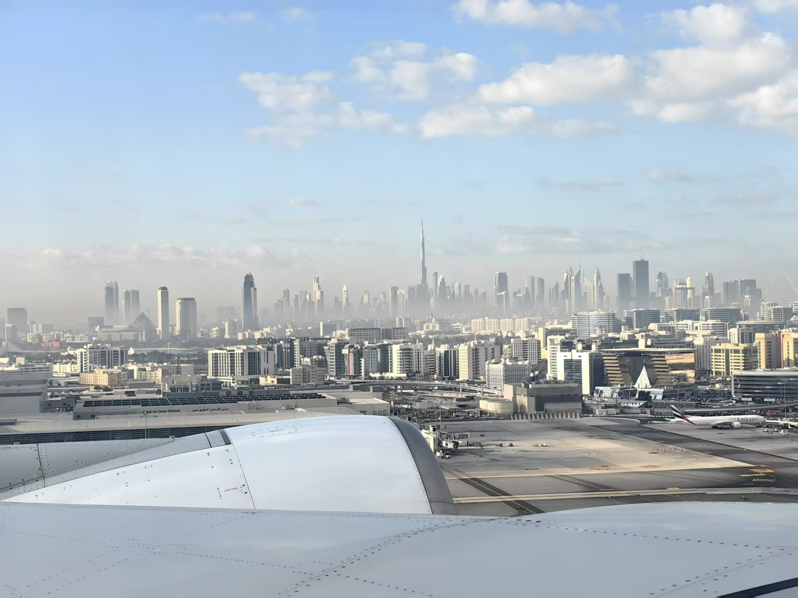

## 丝滑的转机体验

凌晨五点，我们的飞机降落在T3航站楼。T3主要服务阿航飞机，总体来说转机体验相当丝滑。大概落地前1小时，飞机娱乐屏上能看到转机登机口信息。下飞机走了大概十分钟，过了一道简单的转机安检（很水，包里的电脑都不用拿出来），又走了十分钟就到了登机口。机场的指示牌设计的恰到好处，能出现在该有的地方，转机只需要沿着红色的"Connections"一直走就行，完全不用担心迷路。相比于PVG零零散散的指示牌，感觉DXB更胜一筹。

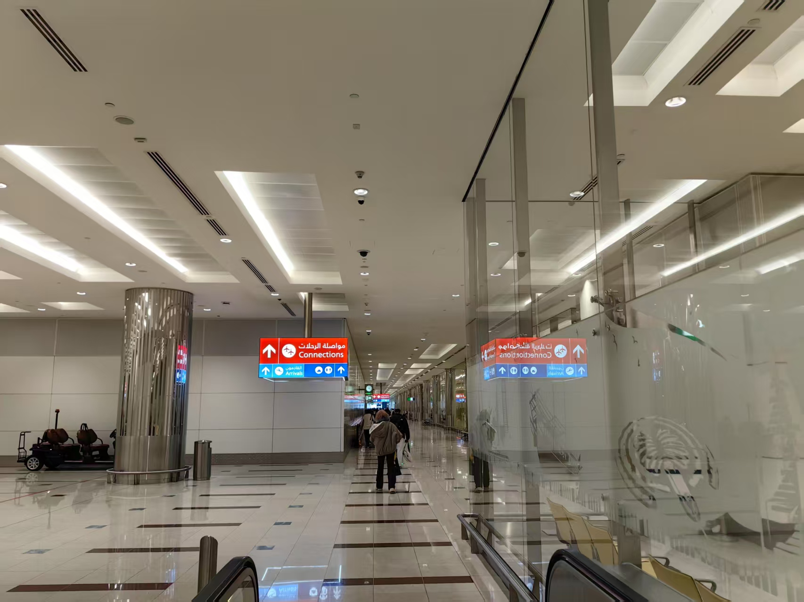

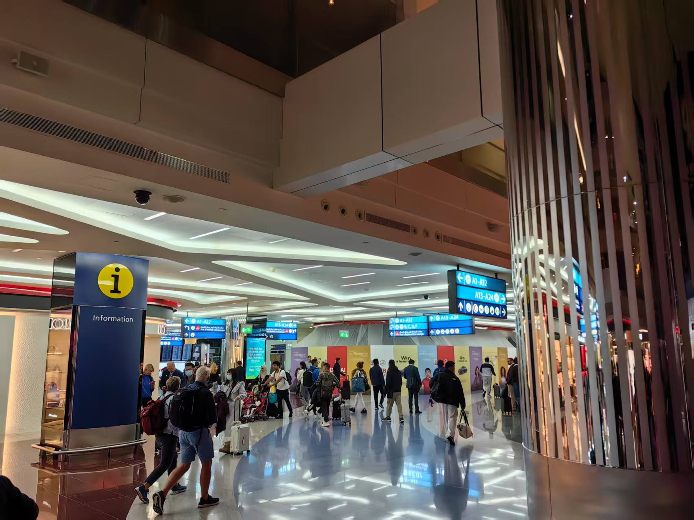

## 超多A380！！！

早就听说阿航有100多架超大规模的380机队，但亲眼见到还是相当震撼。在滑行的时候一眼望去全是B777和A380，我从未见过如此繁忙的机场，早上8点起飞就已经排起了长队，也从未在一个机场见过如此多的380（起码十几二十架），实在是大饱眼福。话不多说，直接上图。

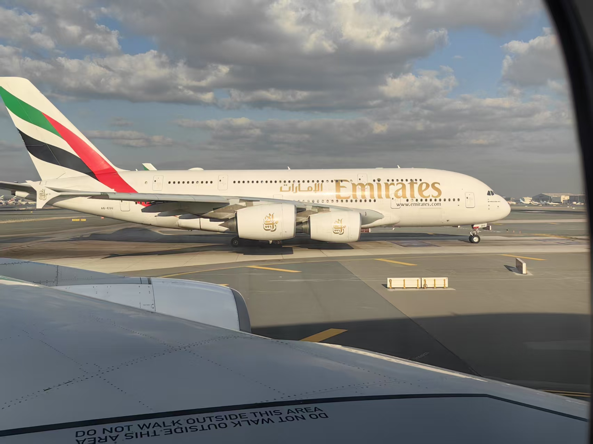

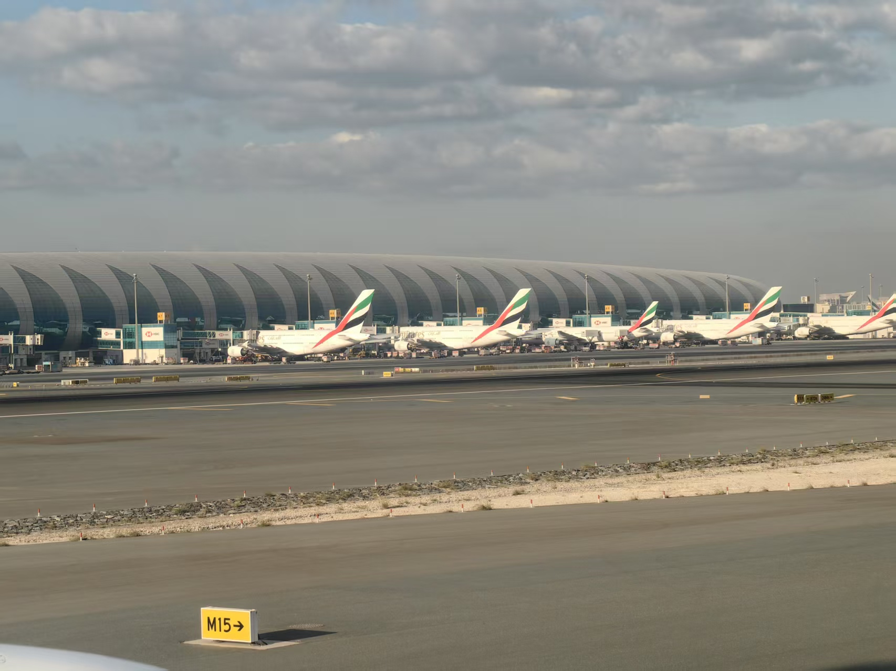

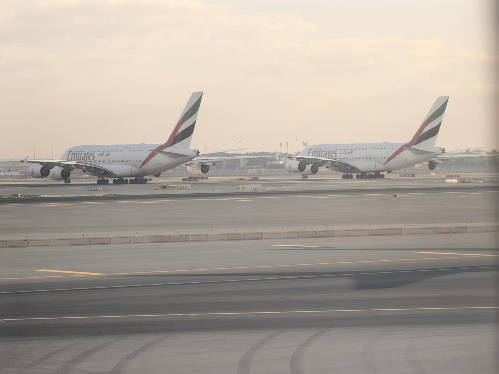

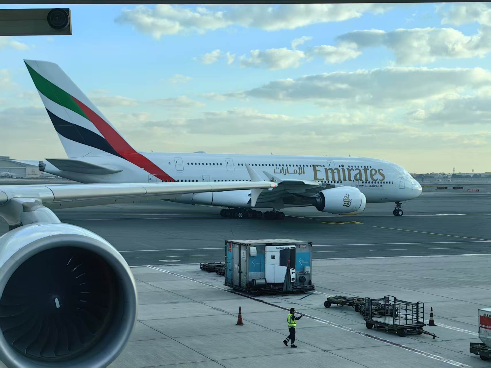

## 贵！贵！贵！

转机体验好归好，但yysy迪拜物价是真心贵。阿联酋的货币是AED（迪拉姆），1AED约等于2RMB。一点小小的物价震撼：一杯卡布奇诺41AED（82人民币），四块炸鸡50AED（100人民币），感觉物价水平和美国有的一拼，只能说土豪的世界我不懂，没事别来阿联酋旅游（逃）。

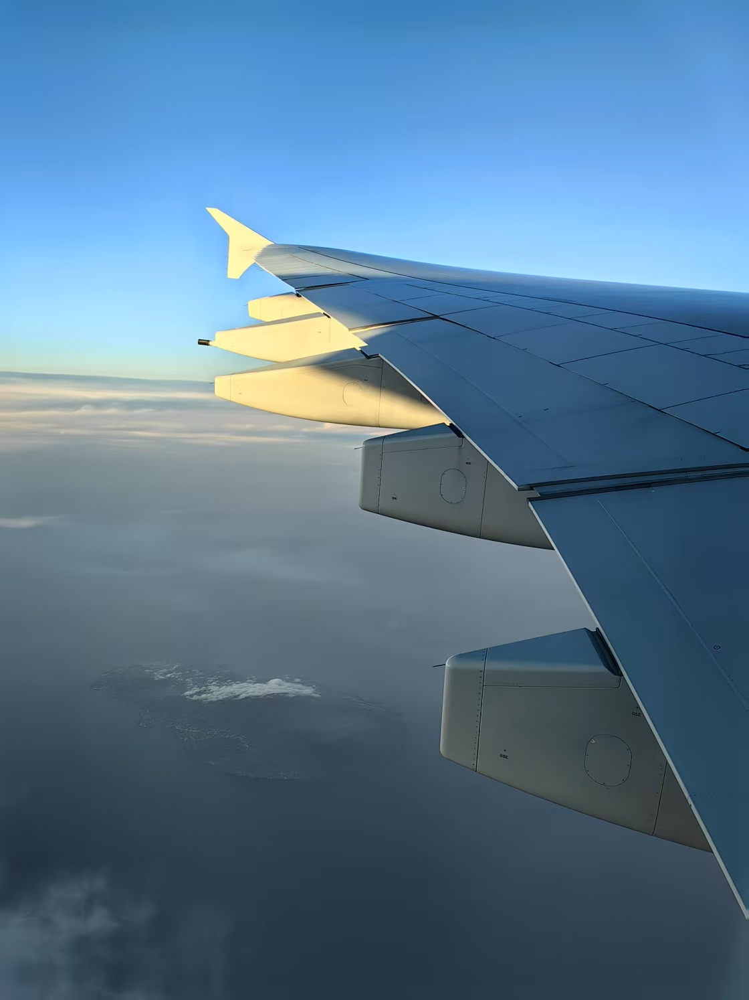

## 碎笔

### Emirates小飞机

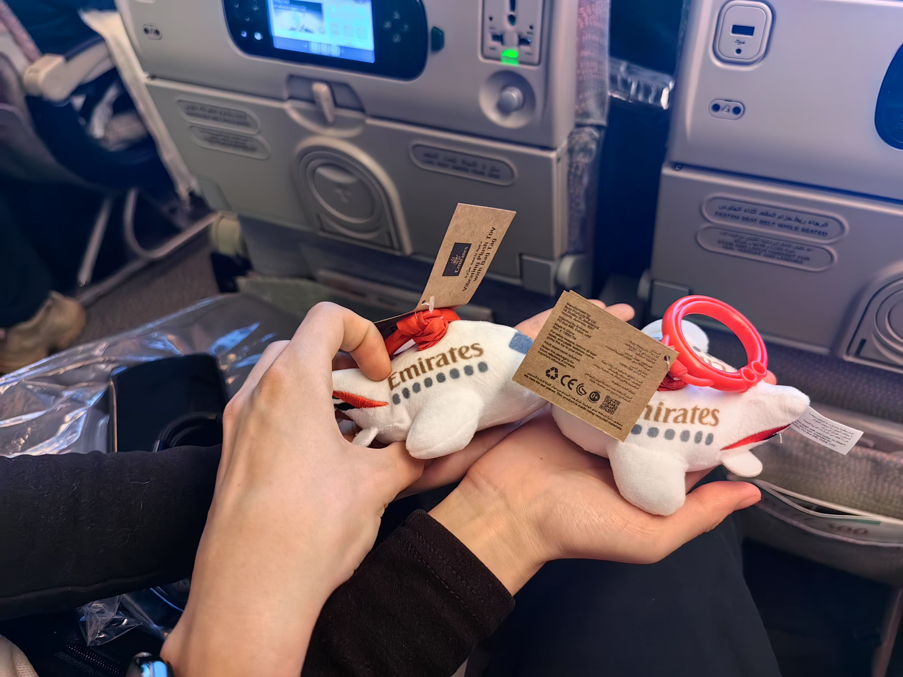

emmm...理论上这个东西是只能发给小朋友的，但是！！俗话说“会哭的孩子有奶吃”，只要脸皮够厚问空姐要一般都是会给滴：

> "Excuse me, can I have a toy airplane?"
> 
> "Sorry sir, it's only for kids."
> 
> "（乞求的眼神）"

然后就能得到小飞机了（）。来回一共4段航班我要到了3个，npy要到了2个，嗯，就很舒服。

### A380和B777

从上海飞迪拜坐的是波音777-300ER，十几年的机龄，实在是有些老了，座位很窄很小，而且我坐的那个甚至是坏的，没有办法调节，和空姐、地勤沟通之后说没办法解决，只能作罢。（阿航快给我更新机队！我要350！）

相比之下双层四引擎的A380就很舒服，很新很宽敞，屏幕也很大。由于我们选了3人位中的两个而剩下的一个没被选，所以我们相当于2个人占了3个位置，半躺着睡觉超爽。

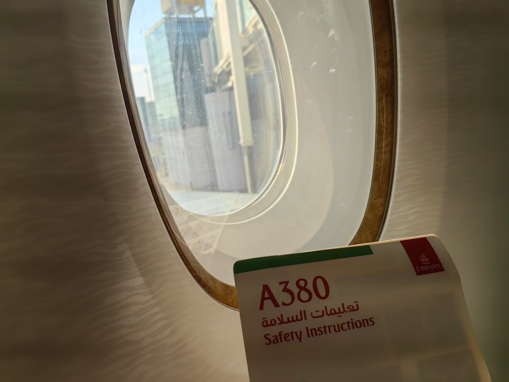

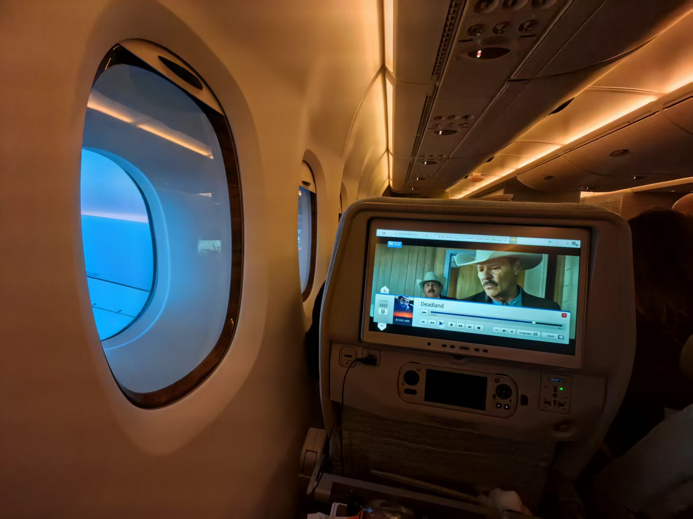