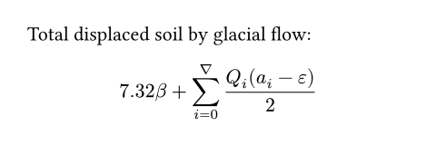

- 什么是 Typst ？

:::tip
Typst 是一种新兴的、轻量的标记语言（大概也就五六年历史），定位与 LaTeX 类似。
:::

- 为什么要用 Typst？或者说，Typst 的优势是什么？

:::important[INFO]
相信有用过 LaTeX 的大家都知道，LaTeX 最折磨的就是等待编译的时间，而 Typst 相比于传统的 LaTeX，Typst 的优势在于语法简洁，且可以**实时编译**！不管是写报告还是平时做笔记，Typst 都能助你事半功倍，效率起飞。
:::

以下介绍了 Typst 的核心语法，10分钟包入门，直接上手写报告。

# Typst 安装配置

虽然本地写 Typst 也很方便，但强烈推荐 [Typst.app](https://typst.app) 这个在线编辑网站（类似Overleaf）。Typst.app 提供了丰富的模板，支持从 LaTeX 转换成 Typst 格式，也支持团队协作编辑。

## 本地配置

如果你说，我不想在线编辑，那就乖乖按以下步骤配置吧！访问 Typst 的 [Github网站](https://github.com/typst/typst)，在 `release` 中选择自己操作系统的安装包下载，例如 Windows 就选择 `typst-x86_64-pc-windows-msvc.zip` 这个。下载完成后解压安装包，把里面的文件放在想要放的目录下，然后记住这个目录，去配置环境变量（具体怎么配置就略过了，网上有教程）。打开终端，输入 `Typst`，如果显示`Welcome to Typst, we are glad to have you here! ❤️`等内容则配置成功。

之后打开 VSCode，在插件中搜索并安装 `Typst Companion` 和 `Tinymist Typst`，就可以在 VSCode 里敲 Typst 代码啦！

# Typst 核心语法

:::note
Typst 文件的后缀名是 `.typ`。
:::

:::note[粗体，斜体]
- 粗体：使用`*`包裹文本
- 斜体：使用`_`包裹文本
:::

## 节指令（标题）

- 一级标题 `= X`，即 X 为一级标题
- 二级标题 `== X`，即 X 为二级标题
- 以此类推...

示例：
```typst
= 这是一级标题
== 这是二级标题
=== 这是三级标题
...
```

## 列表

### 有序列表

有序列表指列表元素的前方以 `1`, `2`, `3` 等标记， 使用的指令为 `+`，即在每一个列表元素前加上一个 `+` 号：

`+ 有序列表元素1`<br>
`+ 有序列表元素2`<br>
`+ 有序列表元素3`

效果如下：

```md
1. 有序列表元素1
2. 有序列表元素2
3. 有序列表元素3
```

### 无序列表

顾名思义，无序列表和有序列表唯一的区别就是，无序列表每一个元素前方是`·`，通常适合并列列举的元素。

`- 无序列表元素1`<br>
`- 无序列表元素2`<br>
`- 无序列表元素3`

效果如下：

```typst
· 无序列表元素1
· 无序列表元素2
· 无序列表元素3
```

## 图指令

以一个例子来说明：

```typst
#figure(
  image("./glacier.jpg", width: 70%),
  caption: [
    _Glaciers_ form an important part of the earth's climate system.
  ],
) <fig:glaciers>
```

具体解释：

- `#figure()`是插入图片的基本语法，如果不想添加其他格式，最简单的图片插入语句是`#image("glacier.jpg")`，这样将使用默认格式。
- `image("./glacier.jpg", width: 70%)`说明了要插入图片的相对路径（也可以用绝对路径、url等），以及占全行的宽度（70%）。
- `caption:[_Glaciers_ form an important ...]`是图片下方的文字说明
- `<fig:glacier>`是插入图片的标签，引用的时候会用到

效果如下：


## 表指令

还是以一个例子来说明：

```typst
#table(
    columns: (1fr, auto, auto),
    inset: 10pt,
    align: horizon,
    table.header(
        [], [*Volume*], [*Parameters*],
    ),
    image("cylinder.svg"),
    $ pi h (D^2 - d^2) / 4 $,
    [
        $h$: height \
        $D$: outer radius \
        $d$: inner radius
    ],
    image("tetrahedron.svg"),
    $ sqrt(2) / 12 a^3 $,
    [$a$: edge length]
)
```

具体解释：

- `#table(`是 Typst 中创建表格的语法。#table 是表格的构造函数，表示开始定义一个表格。
- `columns: (1fr, auto, auto)`定义表格的列宽：
  - `1fr`：第一列占用剩余可用空间（fr 是分数单位，表示比例分配）。
  - `auto`：第二列和第三列根据内容自动调整宽度。
- `inset: 10pt`设置表格单元格的内边距（padding）为 10pt（点）。
- `align: horizon`设置表格内容的对齐方式为水平对齐
- `table.header()`定义表格的表头部分
- 剩余部分，以`image`, 数学公式`$$`或表格元素`[]`对应填入表格的内容

效果如下：


## 数学公式

Typst 的数学公式插入和 LaTeX 基本相似，稍有不同的是在命令中不使用`\`，如 LaTeX 写法为 `$ 7.32 \beta + \sum_{i=0}^\nabla \frac{Q_i}{2} $` 的公式，Typst 写为 `$ 7.32 beta + sum_(i=0)^nabla Q_i / 2 $`，更加简洁一些。其他的一些区别是例如替换一些 LaTeX 中的花括号 `{}` 为圆括号 `()`等等

### 行内公式

行内公式是指嵌入在一行内的公式，不会另外单独一行显示，举例如下：

```typst
The equation $Q = rho A v + C$ defines the glacial flow rate.
```

效果如下：

The equation $ Q = \rho A v + C $ defines the glacial flow rate.

### 行间公式

指公式另起一行单独显示，并且会有相应的编号：

```typst
Total displaced soil by glacial flow:

$ 7.32 beta + sum_(i=0)^nabla (Q_i (a_i - epsilon)) / 2 $
```

效果如下：



可以发现，行内公式和行间公式的区别就是：行内公式在左`$`后和右`$`前都没有空格，而行间公式需要各加一个空格。

## 参考文献

> 使用`bibliography`函数向文档中添加参考文献，此函数需要参考文献文件的路径。

假设有一个名`works.bib`的文件，需要将其中的内容插入到文章末尾，那么使用`#bibliography("works.bib")`即可，示例如下：

```typst
= Methods
We follow the glacier melting models
established in @glacier-melt.

#bibliography("works.bib")
```

效果如下：


# All in One: 一个具体的例子

```typst
= 气候变化对冰川融化的影响研究

== 摘要

本文研究了气候变化对全球冰川融化的影响，分析了冰川体积变化的数学模型，并基于实际数据进行了模拟。

== 引言

冰川是地球气候系统的重要组成部分，其变化对全球海平面、水资源分布和生态系统具有深远影响。

== 研究方法


冰川体积变化可以用以下公式描述 @ipcc2021：

$ V(t) = V_0 - sum_0^t (alpha T(t) + beta) times T(t) $

其中：
- $V(t)$ 是时间 $t$ 时的冰川体积。
- $V_0$ 是初始冰川体积。
- $alpha$ 是温度对融化速度的影响系数。
- $beta$ 是基础融化速率。
- $T(t)$ 是时间 $t$ 时的气温。

== 结果与讨论

根据模型计算，全球主要冰川的体积变化如下表所示：

#table(
    columns: (1fr, auto, auto),
    inset: 5pt,
    align: horizon,
    table.header(
        [*冰川名称*], [*初始体积 (km³)*], [*当前体积 (km³)*],
    ),
    [格陵兰冰川], [2,850], [2,650],
    [南极冰川], [26,500], [26,200],
    [阿尔卑斯冰川], [100], [85],
)


== 结论

本研究通过数学模型和实际数据分析，证实了全球气候变暖对冰川融化的显著影响。

== 参考文献

#bibliography("references.bib")
```

最终效果如下：


# 写在最后

> 本文主要参考：[Typst中文文档](https://typst-doc-cn.github.io/docs/)，[Typst官方文档](https://typst.app/docs/)。

:::caution
本文只介绍了最最基本的Typst语法，且算是一个简单的入门。"The best way to learn a programming language is to write programs in it"，想要熟练使用Typst，最好的方法就是用它去写报告，在实践中探索Typst！
:::

Typst 是一门非常年轻的编程语言，也在获得越来越多的关注度，将 markdown 的简洁和 LaTeX 的优雅完美结合起来，是其他任何一门标记语言都做不到的。

So, why not Typst?