# FCOS 简介

FCOS，全称 Fully-Convolutional One-Stage Object Detection，在2019年由澳大利亚的研究人员提出。在当时的 CV 领域，主流目标检测模型如 RetinaNet, SSD, YOLOv3 和 Faster R-CNN 都是 Anchor-Based，即先生成初始预测框再进行调整。Anchor-Based 的模型的性能受到 Anchor 大小和比例影响非常大，而且为了保证检测的高 Recall 率，往往需要在原图中放置超过 180K 个 Anchor box，使得计算代价非常大。

为此，研究人员提出了 FCOS，即不预先生成 Anchor box，只基于大量的卷积层确定预测框的位置，从而避免了 Anchor-Based 模型带来的问题。同时，他们提出了 Centerness 的概念，来弥补像素点与对应 box 中心的误差。

# FCOS 三层结构

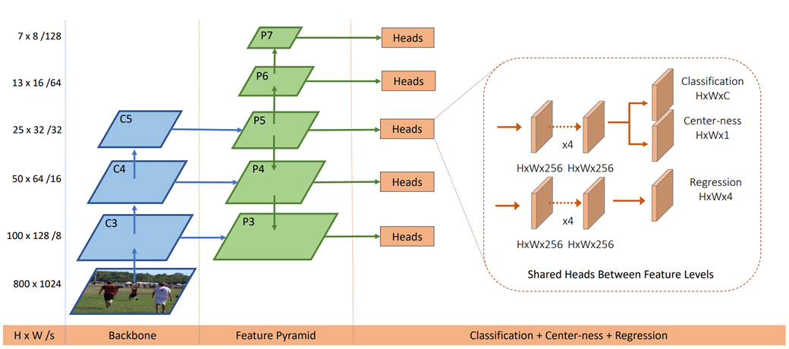

如图所示，整个模型一共可以分为3大层：`Backbone`, `Feature Pyramid (FPN)` 和 `Head` 输出端。

:::caution
以下实现的只是简化版的 FCOS，例如减少了卷积层，删去了 p6，p7，原模型详见文末链接
:::

## Backbone

Backbone 由大量的卷积和池化层构成，采用的卷积架构是 RegNetX-400MF。由输入图像到 c3 经过了 `Convolution---MaxPooling---Convolution---Maxpooling---Convolution---Maxpooling` 的过程，每次的卷积都使用 $3\times 3$ 的卷积核，stride=1, padding=1，因此卷积不改变原图尺寸，使用的 $2 \times 2$ 最大池化每次使图像宽、高减半。c3 的宽、高为原图的 $1/8$，c4 为 $1/16$，c5 为 $1/32$。

## FPN

FPN 层横向连接了 c3，c4，c5 层，并通过卷积进一步提取特征。为了简化模型，删去了原 FPN 的 p6, p7 层，只保留 p3，p4，p5层，构建过程如下：

- c5 层通过一个 $1\times 1$ 的横向卷积层和一个 $3 \times 3$ 的输出卷积层得到 p5 层。
- c4 层同样先通过一个 $1\times 1$ 的横向卷积层得到中间层（记为temp），之后 temp 和上采样之后的 p5 层叠加，再经过一个 $3 \times 3$ 的输出卷积层得到 p4 层。
- c3 层同理，先横向卷积得到中间层，再与下采样之后的 p4 层叠加，通过输出卷积层得到 p3 层。

将 Backbone 层和 FPN 层合起来定义一个类 DetectorBackboneWithFPN，Python代码实现如下：

```python
class DetectorBackboneWithFPN(nn.Module):
    def __init__(self, out_channels: int):
        super().__init__()
        self.out_channels = out_channels

        _cnn = models.regnet_x_400mf(pretrained=True)

        self.backbone = feature_extraction.create_feature_extractor(
            _cnn,
            return_nodes={
                "trunk_output.block2": "c3",
                "trunk_output.block3": "c4",
                "trunk_output.block4": "c5",
            },
        )

        dummy_out = self.backbone(torch.randn(2, 3, 224, 224))
        dummy_out_shapes = [(key, value.shape) for key, value in dummy_out.items()]

        print("For dummy input images with shape: (2, 3, 224, 224)")
        for level_name, feature_shape in dummy_out_shapes:
            print(f"Shape of {level_name} features: {feature_shape}")

        self.fpn_params = nn.ModuleDict()

        c3_channels = dummy_out["c3"].shape[1]
        c4_channels = dummy_out["c4"].shape[1]
        c5_channels = dummy_out["c5"].shape[1]

        self.fpn_params["lateral_c3"] = nn.Conv2d(c3_channels, out_channels, kernel_size=1, stride=1, padding=0)
        self.fpn_params["lateral_c4"] = nn.Conv2d(c4_channels, out_channels, kernel_size=1, stride=1, padding=0)
        self.fpn_params["lateral_c5"] = nn.Conv2d(c5_channels, out_channels, kernel_size=1, stride=1, padding=0)

        self.fpn_params["output_p3"] = nn.Conv2d(out_channels, out_channels, kernel_size=3, stride=1, padding=1)
        self.fpn_params["output_p4"] = nn.Conv2d(out_channels, out_channels, kernel_size=3, stride=1, padding=1)
        self.fpn_params["output_p5"] = nn.Conv2d(out_channels, out_channels, kernel_size=3, stride=1, padding=1)

    @property
    def fpn_strides(self):
        return {"p3": 8, "p4": 16, "p5": 32}

    def forward(self, images: torch.Tensor):

        backbone_feats = self.backbone(images)

        fpn_feats = {"p3": None, "p4": None, "p5": None}

        c3, c4, c5 = backbone_feats["c3"], backbone_feats["c4"], backbone_feats["c5"]

        lateral_c3 = self.fpn_params["lateral_c3"](c3)
        lateral_c4 = self.fpn_params["lateral_c4"](c4)
        lateral_c5 = self.fpn_params["lateral_c5"](c5)

        p5 = self.fpn_params["output_p5"](lateral_c5)

        p4 = lateral_c4 + F.interpolate(p5, size=lateral_c4.shape[2:], mode="nearest")
        p4 = self.fpn_params["output_p4"](p4)

        p3 = lateral_c3 + F.interpolate(p4, size=lateral_c3.shape[2:], mode="nearest")
        p3 = self.fpn_params["output_p3"](p3)

        fpn_feats = {"p3": p3, "p4": p4, "p5": p5}

        return fpn_feats
```

其中，forward 方法的输入是初始图像，输出是经过 Backbone 和 FPN 之后的 p3，p4，p5三个特征图。

:::tip
- 为什么需要三个维度的特征图？
- 要检测的目标大小不一，根据大小将其划分到对应的 p 层，即较小的划分到 p3，较大的划分到 p5 进行检测，从而更全面地检测目标。
:::

## Head 输出端

Head 用来实现对目标检测结果的输出。原论文中 Head 共有5个，这里减为3个，且共享权重矩阵。每个 Head 的结构都是：首先4个卷积层，从 p 层中进一步提取特征，之后分为3个分支：`Classification` 用于确定预测框中物体的标签（例如，是足球还是自行车），`Center-ness` 用于量化中心度，对应每个像素点是一个常数，`Regression` 用于确定预测框的大小，是一个4维向量 $(\vec{l^\star}, \vec{t^{\star}}, \vec{r^\star}, \vec{b^\star})$，分别对应中心距左、上、右、下边的距离。

代码实现如下：

```python
class FCOSPredictionNetwork(nn.Module):
    def __init__(
        self, num_classes: int, in_channels: int, stem_channels: List[int]
    ):
        super().__init__()

        stem_cls = []
        stem_box = []

        prev_channels = in_channels
        for curr_channels in stem_channels:
            stem_cls.append(nn.Conv2d(prev_channels, curr_channels, kernel_size=1, stride=1, padding=0))
            stem_cls.append(nn.ReLU(inplace=True))
            
            stem_box.append(nn.Conv2d(prev_channels, curr_channels, kernel_size=1, stride=1, padding=0))
            stem_box.append(nn.ReLU(inplace=True))
            
            prev_channels = curr_channels

        for layer in stem_box + stem_cls:
            if isinstance(layer, nn.Conv2d):
                nn.init.normal_(layer.weight, mean=0, std=0.01)
                nn.init.constant_(layer.bias, 0)

        self.stem_cls = nn.Sequential(*stem_cls)
        self.stem_box = nn.Sequential(*stem_box)

        self.pred_cls = nn.Conv2d(prev_channels, num_classes, kernel_size=3, stride=1, padding=1)
        self.pred_box = nn.Conv2d(prev_channels, 4, kernel_size=3, stride=1, padding=1)
        self.pred_ctr = nn.Conv2d(prev_channels, 1, kernel_size=3, stride=1, padding=1)

        torch.nn.init.constant_(self.pred_cls.bias, -math.log(99))

    def forward(self, feats_per_fpn_level: TensorDict) -> List[TensorDict]:
        class_logits = {}
        boxreg_deltas = {}
        centerness_logits = {}

        for level_name, feat in feats_per_fpn_level.items():
            cls_feat = self.stem_cls(feat)
            cls_logits = self.pred_cls(cls_feat)
            ctr_logits = self.pred_ctr(cls_feat)
            
            box_feat = self.stem_box(feat)
            box_deltas = self.pred_box(box_feat)
            
            batch_size, _, H, W = cls_logits.shape
            class_logits[level_name] = cls_logits.permute(0, 2, 3, 1).reshape(batch_size, -1, self.pred_cls.out_channels)
            boxreg_deltas[level_name] = box_deltas.permute(0, 2, 3, 1).reshape(batch_size, -1, 4)
            centerness_logits[level_name] = ctr_logits.permute(0, 2, 3, 1).reshape(batch_size, -1, 1)

        return [class_logits, boxreg_deltas, centerness_logits]
```

# FCOS 训练过程

FCOS 的训练大概可以分为4个阶段：给每一个坐标点分配 GT 框（即真实值），匹配坐标点与 GT Box，计算 Delta 距离和计算中心度。

## 分配 GT 框

GT 框，即 Ground-Truth target，是输入中给定的5D向量，形状为 `(x1, y1, x2, y2, C)`，其中 `(x1, y1)` 为左上角坐标，`(x2, y2)` 为右下角坐标，`C` 为分类标签。为了实现 GT box 的分配，首先需要将特征图中的坐标 `(i, j)` 转换为输入图中的坐标 `(stride * (i + 0.5), stride * (j + 0.5))`，函数实现如下：

```python
def get_fpn_location_coords(
    shape_per_fpn_level: Dict[str, Tuple],
    strides_per_fpn_level: Dict[str, int],
    dtype: torch.dtype = torch.float32,
    device: str = "cpu",
) -> Dict[str, torch.Tensor]:
    location_coords = {
        level_name: None for level_name, _ in shape_per_fpn_level.items()
    }

    for level_name, feat_shape in shape_per_fpn_level.items():
        level_stride = strides_per_fpn_level[level_name]

        H, W = feat_shape[2], feat_shape[3]

        i_indices = torch.arange(H, dtype=dtype, device=device)
        j_indices = torch.arange(W, dtype=dtype, device=device)

        i_grid, j_grid = torch.meshgrid(i_indices, j_indices, indexing="ij")

        xc = (i_grid + 0.5) * level_stride
        yc = (j_grid + 0.5) * level_stride

        location_coords[level_name] = torch.stack([xc.flatten(), yc.flatten()], dim=1)

    return location_coords
```

具体效果如下：

p3 层：

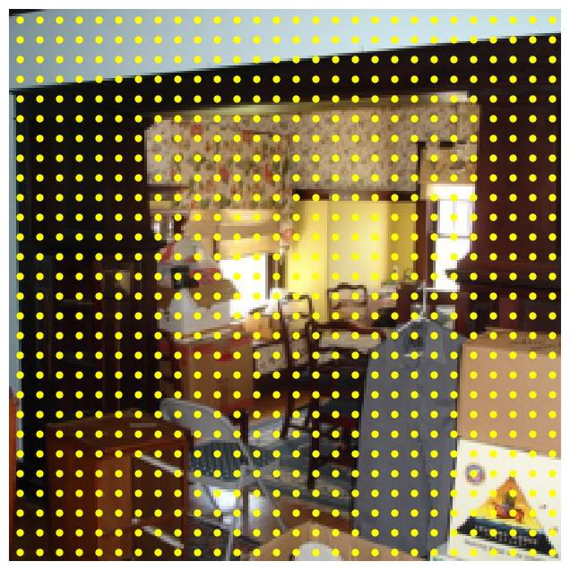

p4 层：


p5 层：

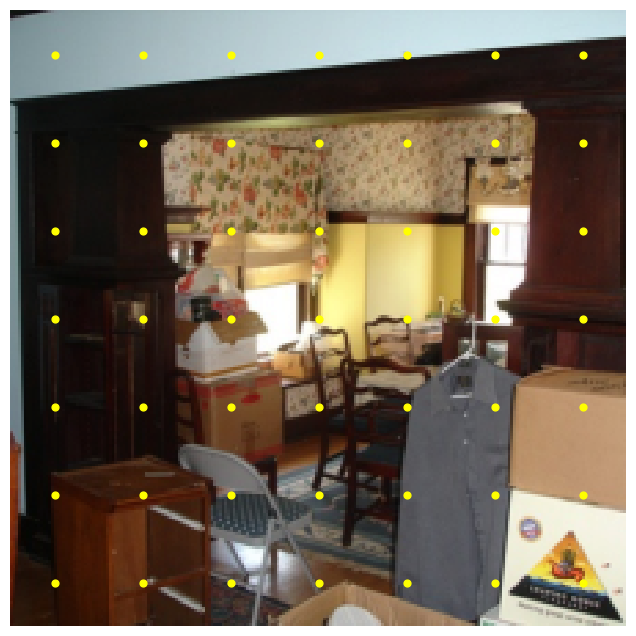

:::tip
可以发现，由于 p3，p4，p5 层的 stride 依次增大，特征图中相同间隔的点在 p3，p4，p5 层中间隔也会依次增大，显得更加稀疏。
:::

## 匹配坐标点与 GT Box

在匹配过程中，有3条规则需要遵守，这也是 GT box 的分配原则：

> 如果坐标点 $N_i$ 在 GT box $M_i$ 中，那么他们就互相匹配。如果出现一个坐标点在两个 Box 中的情况，那么将会优先选择较小的那个。

> 如果一个坐标点 $N_i$ 没有出现在任何一个 GT box 中，那么它就被标记为背景。

> FPN 的不同层负责处理不同大小的 GT box，即 p5 负责处理较大的，p3 负责处理较小的。

因此，最终每一个坐标点都会匹配一个 GT box 和一个相应的分类标签，对应一个5维向量 `(x1, y1, x2, y2, C)`。如果坐标点是背景，那么它对应的向量就是 `(-1, -1, -1, -1, -1)`。

函数实现如下：

```python
@torch.no_grad()
def fcos_match_locations_to_gt(
    locations_per_fpn_level: TensorDict,
    strides_per_fpn_level: Dict[str, int],
    gt_boxes: torch.Tensor,
) -> TensorDict:

    matched_gt_boxes = {
        level_name: None for level_name in locations_per_fpn_level.keys()
    }

    for level_name, centers in locations_per_fpn_level.items():

        stride = strides_per_fpn_level[level_name]

        x, y = centers.unsqueeze(dim=2).unbind(dim=1)
        x0, y0, x1, y1 = gt_boxes[:, :4].unsqueeze(dim=0).unbind(dim=2)
        pairwise_dist = torch.stack([x - x0, y - y0, x1 - x, y1 - y], dim=2)

        pairwise_dist = pairwise_dist.permute(1, 0, 2)

        match_matrix = pairwise_dist.min(dim=2).values > 0

        pairwise_dist = pairwise_dist.max(dim=2).values

        lower_bound = stride * 4 if level_name != "p3" else 0
        upper_bound = stride * 8 if level_name != "p5" else float("inf")
        match_matrix &= (pairwise_dist > lower_bound) & (
            pairwise_dist < upper_bound
        )

        gt_areas = (gt_boxes[:, 2] - gt_boxes[:, 0]) * (
            gt_boxes[:, 3] - gt_boxes[:, 1]
        )

        match_matrix = match_matrix.to(torch.float32)
        match_matrix *= 1e8 - gt_areas[:, None]

        match_quality, matched_idxs = match_matrix.max(dim=0)
        matched_idxs[match_quality < 1e-5] = -1

        matched_boxes_this_level = gt_boxes[matched_idxs.clip(min=0)]
        matched_boxes_this_level[matched_idxs < 0, :] = -1

        matched_gt_boxes[level_name] = matched_boxes_this_level

    return matched_gt_boxes
```

实现效果如下：

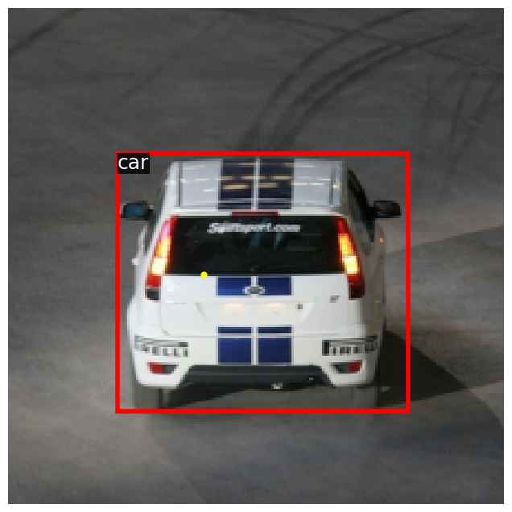

## 计算 Delta 距离

:::note
- 为什么不使用绝对距离，要引入 Delta 距离？
- 绝对距离往往数值较大，易引起梯度爆炸，需要进行标准化。
:::

Delta 距离，也称 LTRB regression target，定义如下：

$$
   l^\star = x_c - x_1, \quad t^\star = y_c - y_1, \quad r^\star = x_2 - x_c, \quad b^\star = y_2 - y_c
$$

其中，加有 `*` 的是 Delta 距离，`(xc, yc)` 是中心点的坐标，`(x1, y1, x2, y2)` 是 GT 边界框的坐标。

以下两个函数分别实现了从实际距离到 Delta 距离的转换，和 Delta 距离到实际距离的转换：

```python
def fcos_get_deltas_from_locations(
    locations: torch.Tensor, gt_boxes: torch.Tensor, stride: int
) -> torch.Tensor:
    deltas_list = []

    for actual_loc, gt_loc in zip(locations, gt_boxes):
        if gt_loc[0] == -1: 
            deltas_list.append(torch.tensor([-1, -1, -1, -1], device=locations.device))
        else:
            left = (actual_loc[0] - gt_loc[0]) / stride
            top = (actual_loc[1] - gt_loc[1]) / stride
            right = (gt_loc[2] - actual_loc[0]) / stride
            bottom = (gt_loc[3] - actual_loc[1]) / stride
            deltas_list.append(torch.tensor([left, top, right, bottom], device=locations.device))

    deltas = torch.stack(deltas_list, dim=0)

    return deltas
```

```python
def fcos_apply_deltas_to_locations(
    deltas: torch.Tensor, locations: torch.Tensor, stride: int
) -> torch.Tensor:
    output_boxes_list = []

    for delta_loc, center_loc in zip(deltas, locations):
        if delta_loc[0] == -1:
            output_boxes_list.append(torch.tensor([locations[0][0], locations[0][1], locations[0][0], locations[0][1]], device=deltas.device))
        else:
            x1 = center_loc[0] - delta_loc[0] * stride
            y1 = center_loc[1] - delta_loc[1] * stride
            x2 = center_loc[0] + delta_loc[2] * stride
            y2 = center_loc[1] + delta_loc[3] * stride

            x1 = max(0, x1)
            y1 = max(0, y1)
            x2 = max(0, x2)
            y2 = max(0, y2)

            output_boxes_list.append(torch.tensor([x1, y1, x2, y2], device=deltas.device))

    output_boxes = torch.stack(output_boxes_list, dim=0)

    return output_boxes
```

## 计算中心度

中心度 `centerness` 由 Delta 定义：

$$
    centerness = \sqrt{\frac{\min(l^\star, r^\star)}{\max(l^\star, r^\star)} \times \frac{\min(t^\star, b^\star)}{\max(t^\star, b^\star)}}
$$

可以发现，centerness 的范围是 [0, 1]，越接近中心，centerness 越接近1，反之越靠近边缘 centerness 越小，下面是一张更加形象的热力图解释，颜色越红表示中心度越高，越蓝表示中心度越低：

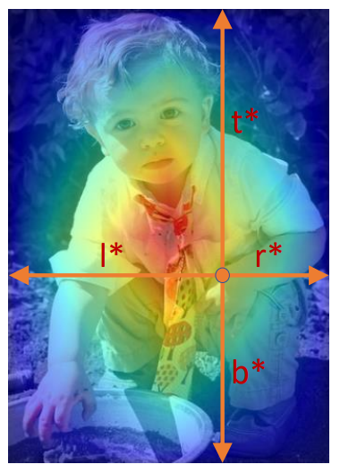

:::tip
- 为什么需要中心度？
- 中心度的引入可以过滤掉低质量的 box，即 $score_{final} = score_{classification} \times centerness$，如果中心点太接近边缘，centerness 的得分就会比较低，从而使得总得分较低，实现过滤。
:::

是否引入中心度对模型预测正确率的影响：

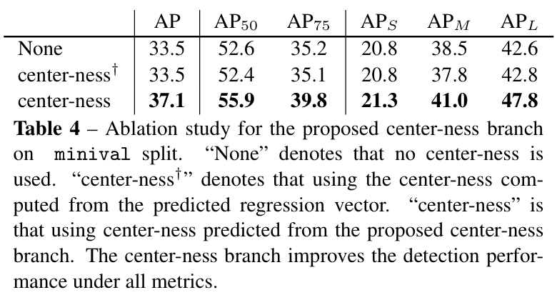

中心度计算代码如下：

```python
def fcos_make_centerness_targets(deltas: torch.Tensor):
    centerness = torch.zeros(deltas.shape[0], device=deltas.device)

    for i, item in enumerate(deltas):
        if item[0] == -1: 
            centerness[i] = -1
        else:
            left, top, right, bottom = item

            min_lr = torch.min(left, right)
            max_lr = torch.max(left, right)
            min_tb = torch.min(top, bottom)
            max_tb = torch.max(top, bottom)

            ctrness = torch.sqrt((min_lr / max_lr) * (min_tb / max_tb))
            centerness[i] = ctrness

    return centerness
```

# 损失函数与 NMS

## 损失计算

上面提到，FCOS 共有3个输出维度：`Object Classification`, `Box Regression` 和 `Centerness Regression`。因此，总损失是以上三者的和（对于分类是背景的 box，Regression 损失计为0）。

1. Object Classification

使用[Focal Loss](https://arxiv.org/pdf/1708.02002)，cross-entropy loss 的一种扩展，能很好地处理分类不均衡。由于 FCOS 训练过程中目标的个数有限，绝大多数坐标点都会被归于背景，因此如果不能很好地处理分类不均的问题，模型会对每个点都输出 "Background"。

2. Box Regression

使用简单的 L1 loss，从而使预测值和实际值的 LTRB Delta 距离之差最小。

3. Centerness Regression

由于 Centerness 和 GT target 都是 [0, 1] 之间的实数，因此使用交叉熵损失函数（BCE）来计算损失（交叉熵损失略优于L1损失）。

## NMS 非极大值抑制

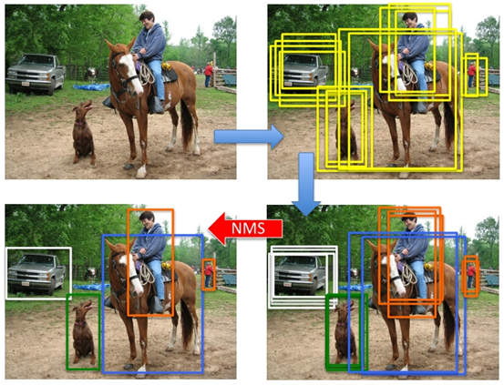

:::warning
如图所示，对于一个待检测的物体，如果不引入 NMS 机制，模型极有可能产生多个位置、大小极其相似的预测框，这显然不是我们想要的结果——我们希望一个物体对应一个预测框。
:::

NMS（非极大值抑制）的算法流程如下：

1. 选定一个得分最高的 box $B_1$
2. 对于剩余的 box，计算他们与 $B_1$ 的 $IoU$ (Intersection over Union，交集与并集的比值，越接近1说明二者重合度越高)，移除 $IoU > Threshold$ 的 box
3. 如果还有剩余的 box，跳转到1

这样就可以保证同一个目标周围不会出现多个预测框，从而建立一对一的映射关系。

代码实现如下：

```python
def nms(boxes: torch.Tensor, scores: torch.Tensor, iou_threshold: float = 0.5):
    if (not boxes.numel()) or (not scores.numel()):
        return torch.zeros(0, dtype=torch.long)

    keep = []

    from two_stage_detector import iou
    ious = iou(boxes, boxes)

    count = boxes.shape[0]
    
    while count > 0:
        max_score_idx = torch.argmax(scores)
        max_score_box = boxes[max_score_idx]
        keep.append(max_score_box)
        count -= 1

        mask = ious <= iou_threshold
        boxes = boxes[:, mask]
        scores = scores[:, mask]
        ious = ious[:, mask]
        count = boxes.shape[0]

    keep = torch.stack(keep, dim=0)

    return keep
```

# 完整的 FCOS 代码实现

将上述所有内容整合到一起，就能实现一个完整的 FCOS 模型啦！(适当添加了注释帮助理解)

```python
class FCOS(nn.Module):
    def __init__(
        self, num_classes: int, fpn_channels: int, stem_channels: List[int]
    ):
        super().__init__()
        self.num_classes = num_classes
        
        self.backbone = DetectorBackboneWithFPN(fpn_channels)
        self.pred_net = FCOSPredictionNetwork(num_classes, fpn_channels, stem_channels)

        # Averaging factor for training loss; EMA of foreground locations.
        self._normalizer = 150  # per image

    def forward(
        self,
        images: torch.Tensor,
        gt_boxes: Optional[torch.Tensor] = None,
        test_score_thresh: Optional[float] = None,
        test_nms_thresh: Optional[float] = None,
    ):
        """
        Args:
            images: Batch of images, tensors of shape `(B, C, H, W)`.
            gt_boxes: Batch of training boxes, tensors of shape `(B, N, 5)`.
                `gt_boxes[i, j] = (x1, y1, x2, y2, C)` gives information about
                the `j`th object in `images[i]`. The position of the top-left
                corner of the box is `(x1, y1)` and the position of bottom-right
                corner of the box is `(x2, x2)`. These coordinates are
                real-valued in `[H, W]`. `C` is an integer giving the category
                label for this bounding box. Not provided during inference.
            test_score_thresh: During inference, discard predictions with a
                confidence score less than this value. Ignored during training.
            test_nms_thresh: IoU threshold for NMS during inference. Ignored
                during training.

        Returns:
            Losses during training and predictions during inference.
        """
        
        fpn_feats = self.backbone.forward(images)
        pred_cls_logits, pred_boxreg_deltas, pred_ctr_logits = self.pred_net.forward(fpn_feats)
        
        fpn_feats_shapes = {level_name: feat.shape for level_name, feat in fpn_feats.items()}
        strides_per_fpn_level = self.backbone.fpn_strides
        locations_per_fpn_level = get_fpn_location_coords(fpn_feats_shapes, strides_per_fpn_level, device=images.device)

        if not self.training:
            # During inference, just go to this method and skip rest of the
            # forward pass.
            # fmt: off
            return self.inference(
                images, locations_per_fpn_level,
                pred_cls_logits, pred_boxreg_deltas, pred_ctr_logits,
                test_score_thresh=test_score_thresh,
                test_nms_thresh=test_nms_thresh,
            )
            # fmt: on

        # List of dictionaries with keys {"p3", "p4", "p5"} giving matched
        # boxes for locations per FPN level, per image.
        matched_gt_boxes = []
                
        B, _, _ = gt_boxes.shape
        for i in range(B):
            matched_gt_boxes.append(fcos_match_locations_to_gt(locations_per_fpn_level, strides_per_fpn_level, gt_boxes[i]))
        
        # Calculate GT deltas for these matched boxes. Similar structure
        # as `matched_gt_boxes` above.
        matched_gt_deltas = []
        matched_gt_centerness = []
        
        for i in range(B):
            deltas_dict = {}
            centerness_dict = {}
            for pi in matched_gt_boxes[i].keys():
                deltas_dict[pi] = fcos_get_deltas_from_locations(locations_per_fpn_level[pi], matched_gt_boxes[i][pi], strides_per_fpn_level[pi])
                centerness_dict[pi] = fcos_make_centerness_targets(deltas_dict[pi])

            matched_gt_deltas.append(deltas_dict)
            matched_gt_centerness.append(centerness_dict)

        # Collate lists of dictionaries, to dictionaries of batched tensors.
        # These are dictionaries with keys {"p3", "p4", "p5"} and values as
        # tensors of shape (batch_size, locations_per_fpn_level, 5 or 4)
        
        matched_gt_boxes = default_collate(matched_gt_boxes)
        matched_gt_deltas = default_collate(matched_gt_deltas)
        matched_gt_centerness = default_collate(matched_gt_centerness)

        # Combine predictions and GT from across all FPN levels.
        # shape: (batch_size, num_locations_across_fpn_levels, ...)
        
        matched_gt_boxes = self._cat_across_fpn_levels(matched_gt_boxes)
        matched_gt_deltas = self._cat_across_fpn_levels(matched_gt_deltas)
        matched_gt_centerness = self._cat_across_fpn_levels(matched_gt_centerness)

        pred_cls_logits = self._cat_across_fpn_levels(pred_cls_logits)
        pred_boxreg_deltas = self._cat_across_fpn_levels(pred_boxreg_deltas)
        pred_ctr_logits = self._cat_across_fpn_levels(pred_ctr_logits)

        # Perform EMA update of normalizer by number of positive locations.
        
        num_pos_locations = (matched_gt_boxes[:, :, 4] != -1).sum()
        pos_loc_per_image = num_pos_locations.item() / images.shape[0]
        self._normalizer = 0.9 * self._normalizer + 0.1 * pos_loc_per_image

        pred_boxreg_deltas = pred_boxreg_deltas.view(-1, 4)
        matched_gt_deltas = matched_gt_deltas.view(-1, 4) 
        pred_ctr_logits = pred_ctr_logits.view(-1)
        matched_gt_centerness = matched_gt_centerness.view(-1) 

        matched_gt_boxes_one_hot = torch.nn.functional.one_hot((matched_gt_boxes[:,:,-1]+1).long(), num_classes=21)
        loss_cls = sigmoid_focal_loss(pred_cls_logits, matched_gt_boxes_one_hot[:,:,1:].float())
        loss_box = 0.25 * F.l1_loss(pred_boxreg_deltas, matched_gt_deltas, reduction='none')
        loss_ctr = F.binary_cross_entropy_with_logits(pred_ctr_logits, matched_gt_centerness, reduction='none')

        loss_box[matched_gt_deltas<0] = 0.0
        loss_ctr[matched_gt_centerness<0] = 0.0

        # Sum all locations and average by the EMA of foreground locations.
        # In training code, we simply add these three and call `.backward()`
        return {
            "loss_cls": loss_cls.sum() / (self._normalizer * images.shape[0]),
            "loss_box": loss_box.sum() / (self._normalizer * images.shape[0]),
            "loss_ctr": loss_ctr.sum() / (self._normalizer * images.shape[0]),
        }

    @staticmethod
    def _cat_across_fpn_levels(
        dict_with_fpn_levels: Dict[str, torch.Tensor], dim: int = 1
    ):
        """
        Convert a dict of tensors across FPN levels {"p3", "p4", "p5"} to a
        single tensor. Values could be anything - batches of image features,
        GT targets, etc.
        """
        return torch.cat(list(dict_with_fpn_levels.values()), dim=dim)

    def inference(
        self,
        images: torch.Tensor,
        locations_per_fpn_level: Dict[str, torch.Tensor],
        pred_cls_logits: Dict[str, torch.Tensor],
        pred_boxreg_deltas: Dict[str, torch.Tensor],
        pred_ctr_logits: Dict[str, torch.Tensor],
        test_score_thresh: float = 0.3,
        test_nms_thresh: float = 0.5,
    ):
        """
        Run inference on a single input image (batch size = 1). Other input
        arguments are same as those computed in `forward` method. This method
        should not be called from anywhere except from inside `forward`.

        Returns:
            Three tensors:
                - pred_boxes: Tensor of shape `(N, 4)` giving *absolute* XYXY
                  co-ordinates of predicted boxes.

                - pred_classes: Tensor of shape `(N, )` giving predicted class
                  labels for these boxes (one of `num_classes` labels). Make
                  sure there are no background predictions (-1).

                - pred_scores: Tensor of shape `(N, )` giving confidence scores
                  for predictions: these values are `sqrt(class_prob * ctrness)`
                  where class_prob and ctrness are obtained by applying sigmoid
                  to corresponding logits.
        """

        _, _, H, W = images.shape

        # Gather scores and boxes from all FPN levels in this list. Once
        # gathered, perform NMS to filter highly overlapping predictions.
        pred_boxes_all_levels = []
        pred_classes_all_levels = []
        pred_scores_all_levels = []

        for level_name in locations_per_fpn_level.keys():

            # Get locations and predictions from a single level.
            # We index predictions by `[0]` to remove batch dimension.
            level_locations = locations_per_fpn_level[level_name]
            level_cls_logits = pred_cls_logits[level_name][0]
            level_deltas = pred_boxreg_deltas[level_name][0]
            level_ctr_logits = pred_ctr_logits[level_name][0]

            #   1. Get the most confidently predicted class and its score for
            #      every box. Use level_pred_scores: (N, num_classes) => (N, )
            #   2. Only retain prediction that have a confidence score higher
            #      than provided threshold in arguments.
            #   3. Obtain predicted boxes using predicted deltas and locations
            #   4. Clip XYXY box-cordinates that go beyond thr height and
            #      and width of input image.

            # Compute geometric mean of class logits and centerness:
            level_pred_scores = torch.sqrt(
                level_cls_logits.sigmoid_() * level_ctr_logits.sigmoid_()
            )

            # Step 1:
            most_confident_score, most_confident_class = level_pred_scores.max(dim=1)

            # Step 2:          
            keep = most_confident_score > test_score_thresh
            level_pred_classes = most_confident_class[keep]
            level_pred_scores = most_confident_score[keep]
            level_locations = level_locations[keep]
            level_deltas = level_deltas[keep]

            # Step 3:           
            level_pred_boxes = fcos_apply_deltas_to_locations(level_deltas, level_locations, self.backbone.fpn_strides[level_name])

            # Step 4: Use `images` to get (height, width) for clipping.
            level_pred_boxes[:,0].clamp_(min=0, max=W)
            level_pred_boxes[:,1].clamp_(min=0, max=H)
            level_pred_boxes[:,2].clamp_(min=0, max=W)
            level_pred_boxes[:,3].clamp_(min=0, max=H)

            pred_boxes_all_levels.append(level_pred_boxes)
            pred_classes_all_levels.append(level_pred_classes)
            pred_scores_all_levels.append(level_pred_scores)

        # Combine predictions from all levels and perform NMS.
        pred_boxes_all_levels = torch.cat(pred_boxes_all_levels)
        pred_classes_all_levels = torch.cat(pred_classes_all_levels)
        pred_scores_all_levels = torch.cat(pred_scores_all_levels)

        keep = class_spec_nms(
            pred_boxes_all_levels,
            pred_scores_all_levels,
            pred_classes_all_levels,
            iou_threshold=test_nms_thresh,
        )
        pred_boxes_all_levels = pred_boxes_all_levels[keep]
        pred_classes_all_levels = pred_classes_all_levels[keep]
        pred_scores_all_levels = pred_scores_all_levels[keep]
        return (
            pred_boxes_all_levels,
            pred_classes_all_levels,
            pred_scores_all_levels,
        )
```

效果示例如下：

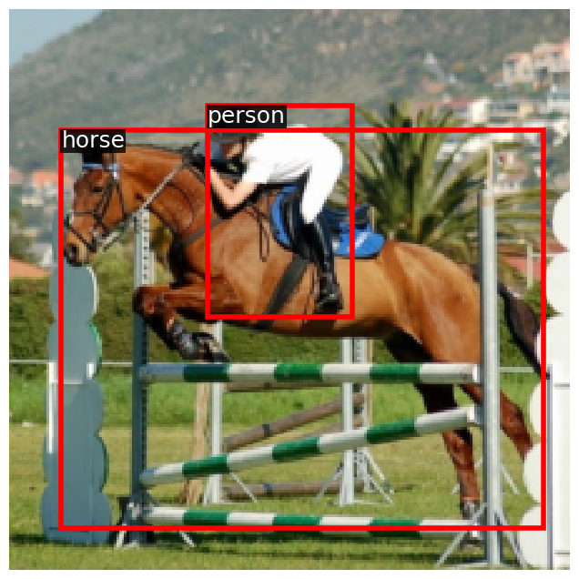

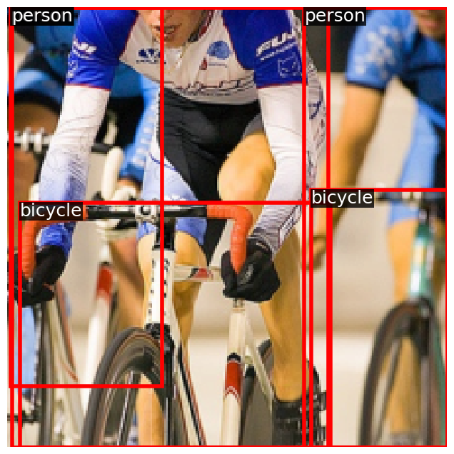

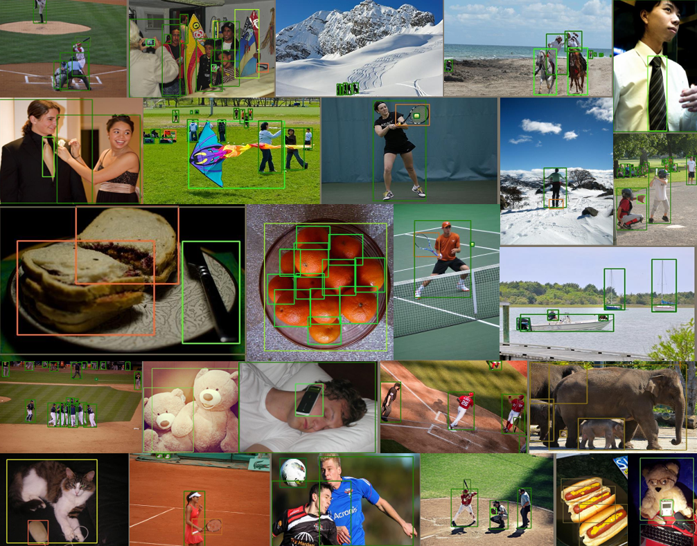

# 总结

作为 Anchor-Free 的经典目标检测模型，FCOS相比于 Anchor-Based 模型极大提高了预测的正确率，在COCO数据集上的 AP 值达到 44.7%，高于 RetinaNet 5.6%， CornerNet 4.2%。FCOS以很小的设计复杂度摆脱了 Anchor-Based 模型导致的复杂计算与超参数调整，并且还可以扩展应用到二阶段检测网络，如 Faster R-CNN 的 RPN 网络中，是一个非常值得学习的目标检测模型。

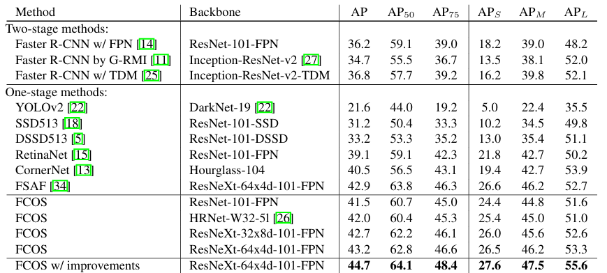

:::important
论文链接：https://arxiv.org/pdf/1904.01355<br>
代码链接：https://github.com/tianzhi0549/FCOS/
:::